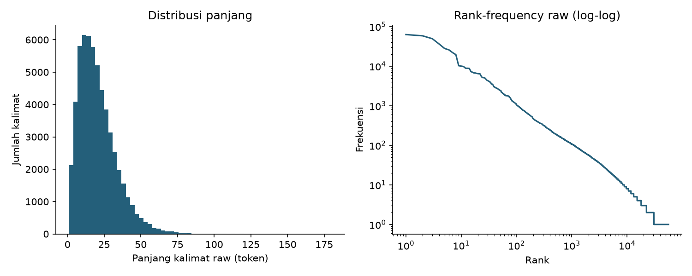
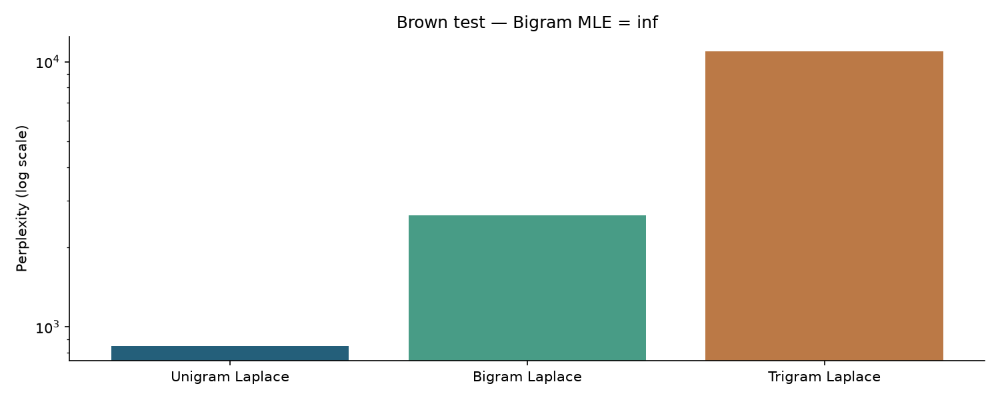
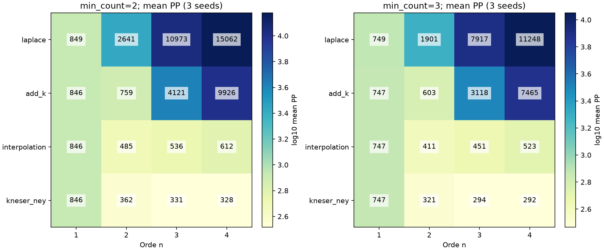
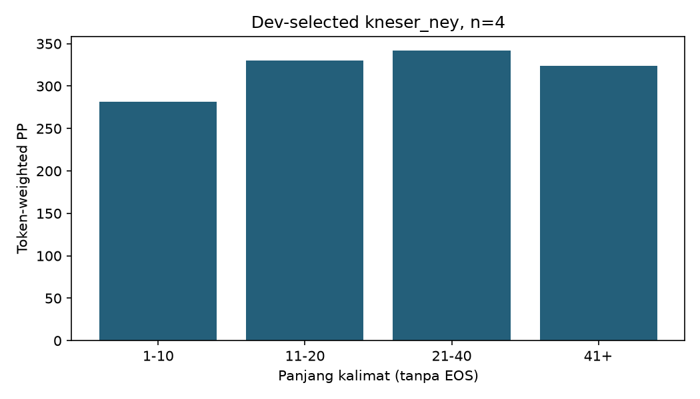
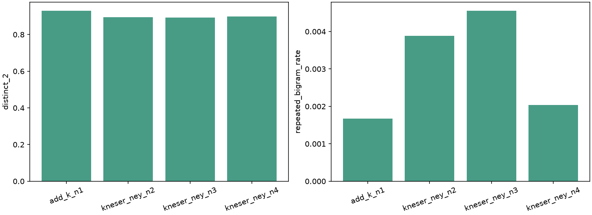
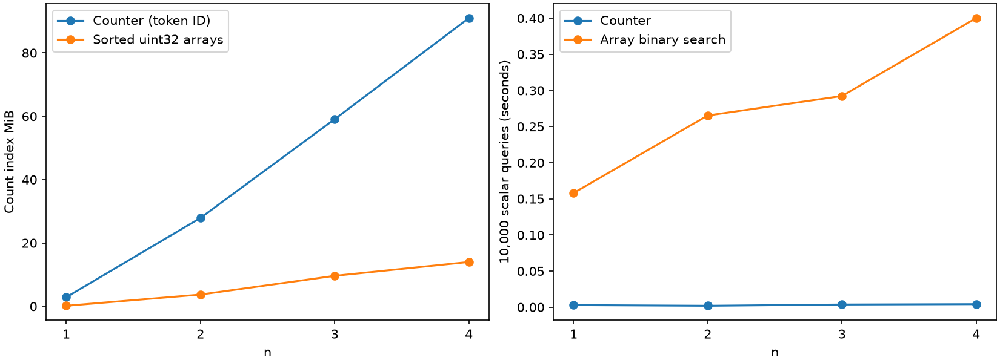

# Laporan N-gram Language Model

## 1. Asumsi & Keputusan Desain

- Corpus Brown penuh, bukan angka ilustrasi. Hash ZIP: `9b275f9b3b95d7bd66ccfb7cd259f445a13bbe5d1f4107aba09fd3e8364bafa6`. Angka raw kebetulan sama dengan ilustrasi karena corpus sama; seluruh hasil dihitung ulang.
- Python 3.11.15; versi library: {"nltk": "3.10.3", "numpy": "2.4.6", "pandas": "3.0.6", "matplotlib": "3.11.2", "pytest": "9.1.1"}. Global seed 42. Seed split ekstensi: 42, 43, 44.
- Brown sudah bertokenisasi. Input teks baru dapat memakai `tokenize()` berbasis NLTK wordpunct. Lowercase dan `str.isalpha()`; punctuation/angka dibuang, huruf Unicode dipertahankan. Loader satu parameter mendukung Brown/Reuters; Pride/GSD belum didukung.
- Core: split indeks kalimat 80/20. Ekstensi: 80/10/10. Vocabulary dan count hanya dari train; singleton menjadi UNK pada min_count=2. Tidak ada refit memakai dev/test.
- Target vocabulary mencakup `<UNK>` dan `</s>`, mengecualikan `<s>`. Padding n−1 BOS, satu EOS. N mencakup EOS; BOS tidak diprediksi. Natural log; log(0)=−inf.
- Konteks dihitung dari event prediksi yang sama dengan target; tidak ada event lintas kalimat. Ini mencegah penyebut konteks terminal/EOS salah.
- Fase 1 selesai dan Run All lulus sebelum ekstensi dibuat. SHA-256 seluruh file core dibekukan; ekstensi tidak mengubah core. Manifest pembekuan dibuat otomatis oleh `jalankan_notebook.py`.
- Normalisasi core memakai penjumlahan probabilitas terlihat plus massa V−T target tak terlihat pada **setiap** konteks train, toleransi 1e-9; konteks tak terlihat uniform. Test mini juga menjumlahkan seluruh V secara eksplisit.
- Add-k: grid k=0.001/0.01/0.1/0.5. Interpolation: bobot uniform, 0.7 pada orde tertinggi, atau 0.7 pada unigram; sisa dibagi rata. Komponen memakai add-0.01 agar tiap distribusi positif dan ternormalisasi. KN: absolute discount tunggal 0.5/0.75/0.9, continuation count untuk orde lebih rendah; bukan Modified Kneser–Ney multi-discount.
- Base KN memakai epsilon=1e-8 untuk dukungan vocabulary, termasuk UNK bila belum terlihat. KN orde 1 memakai unigram raw; orde ≥2 memakai unigram continuation. Stupid Backoff memakai faktor tetap 0.4 dan floor unigram 1e-8.
- Stupid Backoff tidak ternormalisasi: **PP N/A**, negative log score dilaporkan terpisah dalam CSV. Bila dipakai sampling, skor dinormalisasi per konteks; ini bukan distribusi evaluasi PP.
- Semua kandidat dituning pada dev; hanya pemenang tiap konfigurasi dinilai test. Baris pilot 2.1 digunakan ulang pada grid 2.2. CLI round-trip mengulang perhitungan model beku untuk verifikasi, tanpa pemilihan/tuning ulang pada test.

## 2. Hasil Fase 1

Raw: 57,340 kalimat, 1,161,192 token, 56,057 tipe, panjang mean 20.250994.
Processed: 56,766 kalimat, 981,716 token; 574 kalimat kosong dibuang.
Train/test: 45,412/11,354; V=22,356; UNK train=14,533.
OOV test terhadap raw train vocabulary=1.8720%; setelah threshold=3.2408%; setelah pemetaan=0.0000%. Nol setelah mapping berarti semua token terwakili, bukan semua kata dikenal.

| Model | Perplexity | N target |
| --- | --- | --- |
| Bigram MLE | inf | 208096 |
| Unigram Laplace | 845.845680 | 208096 |
| Bigram Laplace | 2633.393140 | 208096 |
| Trigram Laplace | 10977.926776 | 208096 |

Bigram test tak terlihat=26.6992% berdasarkan kemunculan, 49.6682% berdasarkan tipe unik. Contoh aktual `['americans', 'unless']` memiliki count/probabilitas MLE nol.
Kalimat panjang 1200 token: produk=0.0, log P=-9826.710277; ini underflow, bukan event nol.

Unigram Laplace mengalahkan bigram/trigram Laplace pada setup ini. Add-one menyebarkan massa ke V=22.356 target di setiap konteks, sehingga orde lebih tinggi dengan konteks sparse mendekati uniform.
Notebook memuat prediksi next-word dan lima generasi MLE per bigram/trigram; keluaran lengkap di notebook dan `core/results/metrics.json`.
15 test core dan Run All 18 sel telah lulus. Ringkasan ≤1 halaman: `core/results/SUMMARY.md`.

## 3. Hasil Fase 2

### 2.1–2.2: smoothing dan grid sistematis

120 konfigurasi = 4 orde × 5 metode × 2 threshold × 3 seed. Rata-rata aritmetika PP dan sample std (ddof=1), bukan CI atau pooled perplexity.

| min_count | n | Metode | Mean PP ± std (3 seed) |
| --- | --- | --- | --- |
| 2 | 1 | add_k | 845.548 ± 5.035 |
| 2 | 1 | interpolation | 845.567 ± 5.032 |
| 2 | 1 | kneser_ney | 845.545 ± 5.035 |
| 2 | 1 | laplace | 849.313 ± 4.786 |
| 2 | 1 | stupid_backoff | N/A (skor) |
| 2 | 2 | add_k | 758.747 ± 4.142 |
| 2 | 2 | interpolation | 484.760 ± 2.996 |
| 2 | 2 | kneser_ney | 361.619 ± 2.931 |
| 2 | 2 | laplace | 2640.809 ± 7.834 |
| 2 | 2 | stupid_backoff | N/A (skor) |
| 2 | 3 | add_k | 4120.837 ± 58.164 |
| 2 | 3 | interpolation | 536.295 ± 3.292 |
| 2 | 3 | kneser_ney | 330.953 ± 2.949 |
| 2 | 3 | laplace | 10973.038 ± 72.553 |
| 2 | 3 | stupid_backoff | N/A (skor) |
| 2 | 4 | add_k | 9925.502 ± 104.318 |
| 2 | 4 | interpolation | 611.577 ± 3.557 |
| 2 | 4 | kneser_ney | 328.120 ± 2.905 |
| 2 | 4 | laplace | 15061.858 ± 80.741 |
| 2 | 4 | stupid_backoff | N/A (skor) |
| 3 | 1 | add_k | 747.373 ± 1.755 |
| 3 | 1 | interpolation | 747.383 ± 1.754 |
| 3 | 1 | kneser_ney | 747.372 ± 1.755 |
| 3 | 1 | laplace | 749.212 ± 1.709 |
| 3 | 1 | stupid_backoff | N/A (skor) |
| 3 | 2 | add_k | 602.718 ± 1.785 |
| 3 | 2 | interpolation | 411.105 ± 0.316 |
| 3 | 2 | kneser_ney | 320.716 ± 0.321 |
| 3 | 2 | laplace | 1900.750 ± 10.440 |
| 3 | 2 | stupid_backoff | N/A (skor) |
| 3 | 3 | add_k | 3118.400 ± 28.287 |
| 3 | 3 | interpolation | 451.373 ± 0.708 |
| 3 | 3 | kneser_ney | 294.462 ± 1.239 |
| 3 | 3 | laplace | 7917.230 ± 35.108 |
| 3 | 3 | stupid_backoff | N/A (skor) |
| 3 | 4 | add_k | 7464.997 ± 70.046 |
| 3 | 4 | interpolation | 523.122 ± 1.081 |
| 3 | 4 | kneser_ney | 292.226 ± 1.183 |
| 3 | 4 | laplace | 11247.792 ± 42.701 |
| 3 | 4 | stupid_backoff | N/A (skor) |

Pada threshold 2, Kneser–Ney orde 4 mencapai 328.120 ± 2.905, dibanding trigram 330.953 ± 2.949 dan bigram 361.619 ± 2.931. Ini perbandingan dalam representasi threshold sama; overlap std bukan uji signifikansi.
Threshold 3 menurunkan PP sekaligus memperkecil vocabulary dan menggabungkan lebih banyak kata menjadi UNK. PP antarthreshold **tidak** membuktikan perbaikan pengenalan kata asli karena ruang target berubah.
Add-k menolong dibanding add-one, tetapi pada orde tinggi masih kehilangan massa pada target tak terlihat. Interpolation menyediakan konteks pendek sebagai dukungan; KN memakai keragaman continuation, sehingga hasil jauh lebih rendah dalam grid ini.
Skor Stupid Backoff tersedia pada `score_cross_entropy` dan `loss_mean/loss_std` di CSV; jangan membandingkan skor tersebut sebagai likelihood/PP distribusi ternormalisasi.

### 2.3: error dan generasi

Model diagnostik dipilih berdasarkan minimum dev loss pada seed 42/threshold 2: kneser_ney, n=4, parameter {'discount': 0.9}; dev loss=5.779265. Test PP tersimpan=327.772931. Inspeksi test berikut bersifat post-hoc dan tidak mengubah model.

| Target | Kemunculan | Total NLL | Mean NLL |
| --- | --- | --- | --- |
| the | 6913 | 13667.279 | 1.977 |
| </s> | 5677 | 13122.602 | 2.312 |
| <UNK> | 3110 | 12135.018 | 3.902 |
| and | 2828 | 8755.882 | 3.096 |
| a | 2287 | 7318.178 | 3.200 |
| in | 2095 | 7080.142 | 3.380 |
| of | 3563 | 6920.150 | 1.942 |
| to | 2557 | 6543.876 | 2.559 |

Total NLL menyoroti kontribusi agregat; mean NLL mengukur kesulitan per kemunculan. Kata umum bisa dominan dalam total NLL karena sering muncul. Daftar n-gram dan semua target tersimpan di `error_ngram.csv`/`error_token.csv`.

| Panjang kalimat | Kalimat | Target | PP token-weighted |
| --- | --- | --- | --- |
| 1-10 | 1870 | 13233 | 281.494 |
| 11-20 | 2004 | 32549 | 330.468 |
| 21-40 | 1581 | 45495 | 341.689 |
| 41+ | 222 | 11261 | 323.610 |

PP per bucket dihitung dari ΣNLL/Σtarget, bukan rata-rata PP kalimat. Bucket panjang tidak memberi tren monoton; komposisi token/konteks juga berubah.

200 kalimat per model, seed generator 42, cap 40 kata, EOS menghentikan sampling. Distinct-n dihitung pada seluruh keluaran tanpa n-gram lintas kalimat; repetisi bigram adalah Σ(c−1) per kalimat / total bigram. UNK tetap ditampilkan.

| Model | Distinct-1 | Distinct-2 | Repetisi bigram | UNK rate | Panjang mean | Mencapai cap |
| --- | --- | --- | --- | --- | --- | --- |
| add_k_n1 | 0.4338 | 0.9297 | 0.1674% | 1.4785% | 15.895 | 11.50% |
| kneser_ney_n2 | 0.4389 | 0.8943 | 0.3887% | 1.3531% | 15.150 | 7.00% |
| kneser_ney_n3 | 0.4419 | 0.8924 | 0.4555% | 2.4566% | 15.265 | 8.50% |
| kneser_ney_n4 | 0.4376 | 0.8993 | 0.2034% | 1.6831% | 15.745 | 10.50% |

Distinct-2 unigram lebih tinggi daripada KN, tetapi kata acak juga dapat menghasilkan banyak bigram unik. Repetisi rendah dan keragaman tinggi tidak membuktikan koherensi semantik. Tidak dilakukan evaluasi manusia, grammaticality, atau koherensi global. Keluaran lengkap di `generated.json`.

### 2.4: efisiensi

Full train seed 42/threshold 2; kedua representasi memakai token ID yang sama. Array hanya menyimpan n-gram **teramati**, tidak membentuk tensor V^n.

| n | N-gram unik | Counter MiB | Array MiB | Build Counter s | Convert array s | 10k lookup Counter/array s |
| --- | --- | --- | --- | --- | --- | --- |
| 1 | 22356 | 2.878 | 0.171 | 0.551 | 0.032 | 0.00287 / 0.15799 |
| 2 | 323888 | 27.898 | 3.707 | 0.705 | 0.529 | 0.00194 / 0.26531 |
| 3 | 630396 | 59.074 | 9.619 | 0.745 | 1.406 | 0.00365 / 0.29226 |
| 4 | 733700 | 90.977 | 13.994 | 0.628 | 2.171 | 0.00416 / 0.40002 |

Ukuran tabel simbol bersama=2.719 MiB, di luar kolom indeks. Counter diukur dengan recursive `sys.getsizeof` dan deduplikasi object; array memakai `.nbytes` buffer. Ini ukuran indeks count, bukan RSS/peak seluruh model; tidak memasukkan context totals, continuation indices, transient conversion buffers, atau overhead objek NumPy.
Waktu build/convert satu pengukuran; lookup median tiga pengulangan atas 10.000 key teramati pertama. Array lebih hemat memori, lookup scalar binary search lebih lambat pada mesin ini; belum menguji vectorized queries, missing-key workloads, atau scaling lintas mesin.

### 2.5: pembanding eksternal

NLTK `KneserNeyInterpolated` tersedia dan diuji pada 1.000 kalimat train, 2.000 query per orde 2/3. Discount 0.75; vocabulary dan event padding identik; BOS tidak punya target count. Dengan epsilon=0, selisih maksimum bigram/trigram=0.0. Dengan floor default 1e-8, selisih maksimum terhadap versi epsilon=0=8.0201068009e-11.
Ini sanity check terbatas, bukan pembuktian seluruh corpus/context/discount. Neural LM tidak dibandingkan.

### 2.6: packaging

`pyproject.toml`, `uv.lock`, pinned `requirements.txt`, YAML aman, entry point `ngram-lm train/evaluate/generate`. Checkpoint JSON-gzip, schema/count divalidasi, tidak menggunakan pickle. Penulisan memakai temporary di direktori tujuan; checkpoint yang sudah ada ditolak. Evaluasi memeriksa digest corpus dan split seed.
46 test pytest lulus; lint, format, type-check, build wheel/sdist, CLI Brown penuh, dan wheel checkpoint/sampling smoke lulus. Output command tersimpan di `verifikasi/checks.json`. Command reproduksi dan pemetaan artefak tersedia di README.

## 4. Keterbatasan & ancaman validitas

- Random split kalimat dapat memisahkan kalimat dari dokumen sama; indeks terpisah tidak menjamin tema atau isi identik terpisah. Belum ada split document-level, temporal, deduplikasi, atau out-of-domain test.
- Brown bahasa Inggris; Reuters loader tersedia tetapi belum dijalankan. Tidak ada klaim untuk bahasa Indonesia/Pride/GSD.
- Test inti 20% dan test ekstensi 10% berbeda; angka keduanya bukan perbandingan eksperimental langsung.
- Tiga split dari corpus sama tidak independen; mean ± std bukan interval keyakinan. Grid hyperparameter terbatas, tidak exhaustive. Threshold tidak dipilih dari test.
- PP mengukur representasi token/UNK yang disepakati. Perbandingan vocabulary/tokenizer berbeda, termasuk neural LM, belum valid.
- Full normalization core memakai pengelompokan massa yang ekuivalen; ekstensi diuji seluruh V pada corpus mini, bukan semua konteks Brown × seluruh V secara eksplisit.
- Profil indeks count bukan keseluruhan footprint model; waktu bergantung hardware/load. Generasi hanya metrik leksikal, tanpa penilai manusia atau semantic quality.
- Notebook terbukti Run All melalui kernel baru lokal. Notebook GUI/kernel lintas OS dan wheel pada mesin lain belum diuji. Kunci lokal tidak diregistrasikan secara global.

## 5. Referensi

- Jurafsky, D. & Martin, J. H., *Speech and Language Processing*, pembahasan N-gram Language Models. Edisi draft/nomor bab: perlu diverifikasi.
- Chen, S. F. & Goodman, J. (1998), *An Empirical Study of Smoothing Techniques for Language Modeling*, Harvard technical report. Detail nomor laporan/halaman: perlu diverifikasi.
- Kneser, R. & Ney, H. (1995), *Improved backing-off for M-gram language modeling*, ICASSP. Detail volume/halaman: perlu diverifikasi.
- Brants, T. dkk. (2007), *Large Language Models in Machine Translation*, EMNLP-CoNLL. Detail halaman: perlu diverifikasi.
- NLTK versi 3.10.3, kode `nltk.lm.KneserNeyInterpolated`, dipakai hanya pada pembanding ekstensi.

## Catatan pengumpulan

File/folder dirapikan tanpa mengubah angka eksperimen. `core` dan notebook tetap identik; tuning dipindah ke `extensions/results/tuning`, indeks split ke `extensions/results/splits`, checkpoint ke `extensions/results/models`. Build awal berada di `hasil_build/sebelum_perapihan`; build terbaru di `hasil_build/setelah_perapihan`. Peta lokasi dan hash hasil tersedia di `verifikasi/perapihan.json`.

### Perbaikan pemeriksaan tipe editor

Pyright 1.1.414 mereproduksi empat diagnostik Pylance pada `deep_size()` di `extensions/src/sparse.py`. Anotasi return `-> int` memperbaiki inferensi fungsi rekursif, tanpa mengubah perhitungan/profil. Sesudah perbaikan: nol error dan nol warning pada source utama/salinan ekstraksi; 48 test, lint, type-check, dan build tetap lulus. Rekaman: `verifikasi/pylance.json` dan `verifikasi/PYLANCE.md`.

## Penguatan demonstrasi 16 langkah

Notebook pendamping `demonstrasi_ngram.ipynb` memperdalam penjelasan 16 langkah dengan modul core yang sama. Hasil tersimpan dalam `hasil_demonstrasi/`; notebook utama dan 157 hasil lama tetap SHA-256-identik.

- Contoh UNK diambil dari singleton train dan OOV test nyata, dengan indeks kalimat serta konteks sebelum/sesudah pemetaan.
- Tabel per token menampilkan C(h,w), C(h), numerator/denominator, P, dan log P untuk MLE/Laplace pada bigram/trigram. Produk, jumlah log, dan perplexity kalimat dicocokkan dengan fungsi evaluasi. Kalimat panjang menunjukkan underflow meskipun seluruh faktor Laplace positif.
- Top-5 prediksi membandingkan konteks dikenal, tanpa count, dan kata OOV. Skor nol MLE ditandai sebagai tidak memiliki dukungan; OOV dipetakan ke UNK, sementara Laplace pada konteks tanpa count bersifat uniform.
- Generasi memakai seed 42–46 dan cap 40 kata untuk masing-masing bigram/trigram MLE/Laplace. Jejak menyertakan EOS hanya ketika sampling memang berhenti karena EOS. Lima generasi MLE per orde identik dengan hasil awal.

| n | Model | Alasan berhenti | Jumlah dari 5 sampel |
|---|---|---|---|
| 2 | Laplace | batas panjang | 5 |
| 2 | MLE | EOS | 5 |
| 3 | Laplace | batas panjang | 5 |
| 3 | MLE | EOS | 4 |
| 3 | MLE | batas panjang | 1 |

Seluruh 16 pemeriksaan menghasilkan LULUS dalam `hasil_demonstrasi/BUKTI_16_LANGKAH.md`. Corpus mini memverifikasi P(a b) MLE=1/2 dan Laplace=2/49, normalisasi seluruh V, serta penghentian karena EOS/cap/konteks tanpa probabilitas.

Perplexity Brown lama tetap sama. Evaluasi ulang memakai parameter dan partisi tetap untuk memeriksa reproduksi, tanpa pemilihan model atau tuning ulang pada test. Unigram diperiksa dari log likelihood hasil beku; bigram/trigram dibangun ulang dari train yang sama. Perbandingan generasi ini tidak membuktikan koherensi semantik atau generalisasi lintas dokumen.
