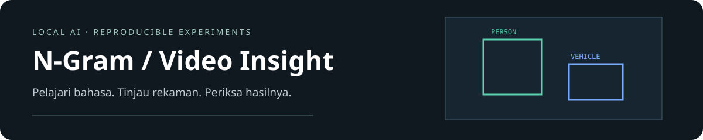

<div align="center">



**Eksperimen bahasa dari nol. Studio analisis video yang berjalan lokal.**

[](https://github.com/Maliq-dlt/N-Gram/actions/workflows/ci.yml)

[Mulai dengan studio](industrial_ai/README.md#mulai-di-windows) · [Laporan N-gram](LAPORAN.md) · [Kontribusi](CONTRIBUTING.md) · [Keamanan](SECURITY.md)

</div>

## Pilih tujuan Anda

| Saya ingin… | Mulai dari sini |
| --- | --- |
| Unggah video, koreksi kotak, dan bertanya tentang rekaman | **[Video Insight](industrial_ai/README.md)** — dashboard, tracking, review, dan fine-tuning lokal |
| Memahami probabilitas kata, smoothing, dan perplexity | **[Proyek N-gram](#mulai-di-windows-powershell)** — notebook dan CLI Python |
| Menilai implementasi dan hasil pengujian | [Verifikasi studio](industrial_ai/reports/WORKFLOW_REVIEW_BELAJAR.md) · [Spesifikasi akademik](SPESIFIKASI_TUGAS.md) |
| Berkontribusi atau memahami batas lisensi | [Panduan kontribusi](CONTRIBUTING.md) · [Komponen pihak ketiga](NOTICE.md) |

> Video Insight ditujukan untuk demonstrasi lokal. Hasil deteksi tetap perlu ditinjau manusia. Bagian akademik mempertahankan core dan hasil eksperimen yang dibekukan.

## Peta repository

```text
N-Gram/
├── industrial_ai/     Studio video, backend, UI, dan tes fitur
├── core/              Implementasi N-gram dan hasil awal yang dibekukan
├── extensions/        Smoothing, eksperimen, dan CLI
├── hasil_demonstrasi/ Bukti langkah pembelajaran N-gram
├── verifikasi/        Manifest SHA-256 dan bukti reproduksi
├── tasks/             Status pengerjaan dan roadmap
├── docs/              Visual dokumentasi
└── .github/           Pemeriksaan otomatis
```

Bobot AI, video pengguna, cache, serta environment lokal dibuat saat setup dan tidak masuk GitHub. Path kode dipertahankan agar import dan reproduksi tetap valid.

## Mulai di Windows PowerShell

Python 3.11 dan uv tersedia. Semua cache/temp disimpan di repository.

```powershell
. .\setup_lokal.ps1
uv sync --locked
uv run pytest -q
uv run python jalankan_notebook.py
```

`jalankan_notebook.py` menjalankan Run All dengan kernel baru dari `.venv`, tanpa memasang kernel global. Membuka notebook di editor tetap boleh; pilih interpreter `.venv`. Brown diunduh pertama kali ke `data/nltk_data`; run berikutnya memakai cache. Root cwd atau folder `core` didukung notebook.

## Demonstrasi rinci dalam 16 langkah

Notebook pendamping [demonstrasi_ngram.ipynb](demonstrasi_ngram.ipynb) memperjelas contoh UNK nyata, numerator/denominator dan log probability per token, prediksi MLE–Laplace pada tiga jenis konteks, serta lima generasi per model dengan seed yang sama dan alasan berhenti. Gunakan setelah membaca notebook utama.

```powershell
. .\setup_lokal.ps1
uv run python jalankan_notebook.py demonstrasi_ngram.ipynb
```

Notebook ini mandiri dari kernel bersih dan memakai modul core asli. Hasil tambahannya tersedia di [hasil_demonstrasi/BUKTI_16_LANGKAH.md](hasil_demonstrasi/BUKTI_16_LANGKAH.md) dan CSV dalam `hasil_demonstrasi/`. Corpus, split 80/20 seed 42, ambang UNK 2, serta model MLE/Laplace tetap sama. Sanity check corpus mini memverifikasi hitungan manual dan tiga alasan berhenti; seluruh file core serta 157 hasil lama diperiksa dengan SHA-256 sebelum/sesudah.

Evaluasi ulang hanya pemeriksaan model tetap, tanpa tuning pada test. Unigram diperiksa melalui rumus log likelihood hasil beku; bigram/trigram diperiksa dengan model yang dibangun ulang dari train yang sama. Notebook utama dan hasil awal tetap utuh. Runner tanpa argumen tetap menjalankan notebook utama; argumen tambahan harus menunjuk file `.ipynb` di dalam repository.

## Reproduksi Fase 2 secara berurutan

Fase 1 wajib lulus lebih dulu. Notebook membuat `.cache/core_frozen.json`; seluruh langkah ekstensi memeriksa hash core sebelum/sesudah run.
Manifest `verifikasi/core_manifest.json` menyediakan pembekuan core ketika cache belum ada. Hasil run nyata sudah disertakan. Runner menolak menimpa hasil eksperimen lama. Untuk run baru, pindahkan **hanya folder `extensions/results`** ke folder backup di repository, lalu jalankan urutan ini. Jangan mengubah core selama Fase 2.

```powershell
. .\setup_lokal.ps1
uv run python -m extensions.experiments.run --stage 21
uv run python -m extensions.experiments.run --stage 22
uv run python -m extensions.experiments.analyze
uv run python -m extensions.experiments.profile
uv run python -m extensions.experiments.compare_nltk
```

Stage 21 menilai lima metode pada trigram seed 42/min_count 2. Stage 22 memakai ulang baris tersebut, lalu melengkapi 120 konfigurasi (n=1..4, lima metode, threshold 2/3, seed 42/43/44). Hyperparameter selalu dipilih dari dev. Test winner hanya sekali dalam grid; analisis test tidak mengubah model. STD memakai ddof=1.

Stupid Backoff adalah skor tak ternormalisasi: PP N/A, `score_cross_entropy` dilaporkan terpisah. Interpolation menggunakan komponen add-0.01. KN memakai single absolute discount, continuation counts, dan floor unigram 1e-8; bukan Modified KN multi-discount.

## CLI dan checkpoint

```powershell
. .\setup_lokal.ps1
uv run ngram-lm train --config extensions/config.yaml --model .tmp/model.json.gz
uv run ngram-lm evaluate --model .tmp/model.json.gz
uv run ngram-lm generate --model .tmp/model.json.gz --seed 42 --count 5 --max-length 40
```

`train` memisahkan 80/10/10, fit train, tuning dev, lalu menyimpan tanpa menilai test. `evaluate` memakai held-out split dan memeriksa digest corpus. Ganti path checkpoint untuk run baru; file yang sudah ada ditolak. JSON-gzip divalidasi, tidak menggunakan pickle. Semua output/cache berada di repository. Untuk menjalankan dari source tanpa entry point, gunakan `uv run python -m extensions.src.cli ...`.

YAML memiliki tepat lima key: `corpus` (brown/reuters), `seed` (uint32), `n` (1..4), `method` (laplace/add_k/interpolation/stupid_backoff/kneser_ney), `min_count` (>=1). Hyperparameter tuned oleh train, bukan disalin dari test. Config default trigram KN/seed 42/threshold 2.

## Verifikasi dan build

```powershell
. .\setup_lokal.ps1
uv run pytest -q
uv run ruff check core extensions jalankan_notebook.py
uv run ruff format --check core extensions jalankan_notebook.py
uv run ty check core/src extensions/src extensions/experiments jalankan_notebook.py
uv build --out-dir hasil_build/setelah_perapihan

git diff --check
git diff --stat
```

`pytest` memakai `.tmp/pytest`; runtime Jupyter/Matplotlib, cache uv dan corpus diarahkan `setup_lokal.ps1`. Runtime/testing dependency dikunci `uv.lock`. `requirements.txt` adalah export runtime pinned, bukan seluruh notebook/test tools; gunakan `uv sync --locked` untuk reproduksi lengkap. Wheel/sdist adalah paket source CLI; notebook dan hasil eksperimen tetap tersedia pada repository, tidak dimasukkan ke wheel. Versi library dicetak di awal notebook.

## Artefak

- `core/ngram_lm.ipynb`: notebook utama terisi semua output, grafik, prediction, generation, test gate.
- `core/src`: loader, preprocessing, n-grams, MLE/Laplace, evaluasi, sampling.
- `core/tests`: hitungan manual, normalisasi, leakage, uniform PP, underflow, boundary, sampling.
- `core/results`: metrics JSON, split indices, gambar, ringkasan ≤1 halaman.
- `extensions/src`: count bank, smoothing, tuning, metrics/sampling, sorted count array, CLI.
- `extensions/tests`: normalisasi, KN manual/NLTK, sampling distribution, sparse lookup, checkpoint validation.
- `extensions/results/experiments.csv`: seluruh final winner per konfigurasi; `summary.csv`: mean/std.
- `extensions/results/tuning/tuning_*.json`: seluruh kandidat dev, tidak memakai test.
- `extensions/results/error_*.csv`, `length_perplexity.csv`, `generation_metrics.csv`, `generated.json`, `profile.csv`, `nltk_comparison.json`: analisis/profil/pembanding.
- `extensions/results/models`: checkpoint hasil train Brown dan mini smoke test.
- `verifikasi`: rekaman command verifikasi, hashes core dan wheel smoke test.

Batas: random split kalimat, satu corpus Inggris, tiga seed saling berbagi corpus, vocabulary berubah antar threshold, metrik generasi leksikal tanpa penilai manusia. Array diukur pada count index saja; hasil waktu bukan benchmark lintas mesin.

## Paket pengumpulan

ZIP siap dikumpulkan: `Tugas_Ngram_Language_Model.zip`, dengan satu folder induk `Tugas_Ngram_Language_Model`.

```text
Tugas_Ngram_Language_Model/
  README.md
  LAPORAN.md
  SPESIFIKASI_TUGAS.md
  jalankan_notebook.py
  setup_lokal.ps1
  core/                  # notebook, kode, test, hasil Fase 1
  extensions/
    src/                 # smoothing dan CLI
    experiments/         # script reproduksi
    tests/
    results/
      tuning/            # 120 log tuning dev
      splits/            # indeks split seed 42, 43, 44
      models/            # checkpoint Brown dan checkpoint mini smoke test
  data/nltk_data/corpora/brown.zip  # corpus asli, tersedia offline
  hasil_build/
    sebelum_perapihan/   # wheel dan sdist hasil awal dipertahankan
    setelah_perapihan/   # build dengan struktur terbaru
  verifikasi/            # rekaman verifikasi, checksum, log, peta perpindahan
  pyproject.toml
  requirements.txt
  uv.lock
```

`core`/`extensions` dan nama modul Python mengikuti spesifikasi agar import tetap valid. Hasil perhitungan, grafik, notebook terisi, log tuning, model terlatih, dan build awal dipertahankan. Cache, virtualenv, metadata build sementara, script pembuat/perbaikan sekali pakai, `.git`, dan konfigurasi alat lokal tidak masuk ZIP. Setelah ekstraksi, jalankan `. ./setup_lokal.ps1` lalu `uv sync --locked` untuk membuat ulang environment lokal.

Nama lama pada `verifikasi/checks.json` merekam command historis. `verifikasi/perapihan.json` memetakan lokasi baru dan SHA-256; hasil perhitungan tidak diubah. `verifikasi/pengumpulan.json` memuat verifikasi setelah perapihan.
