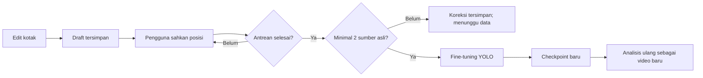

<div align="center">

# Video Insight

**Unggah. Tinjau. Koreksi. Tanya rekamannya.**

[Mulai](#mulai-di-windows) · [Cara kerja belajar](#kapan-ai-benar-benar-belajar) · [Verifikasi](#verifikasi) · [Keamanan](../SECURITY.md) · [Peta dokumentasi](docs/README.md)

</div>

Demo/portofolio untuk unggah video, bandingkan rekaman asli dengan tracking AI,
koreksi objek, dan tanya hasilnya lewat chatbot lokal. Subproyek `industrial_ai`
terpisah dari artefak akademik N-gram di root repository.

## Lab N-gram, ledger, dan absensi manual

Buka **Lab N-gram** di workspace untuk probability explorer, top-k, sliding context dan generasi bertahap. Nilai dihitung backend Python; demo kecil mengajarkan mekanisme dan bukan hasil riset. Tab eksperimen membaca completed pilot metrics dan jejak dev; tidak melatih atau membuka ulang test saat kontrol UI berubah. Checkpoint hanya dibagikan dengan opt-in `public_models`; raw path/upload model bebas tidak diterima. [Metode dan pilot terukur](../extensions/README.md) · [Verifikasi akademik/integrasi](../extensions/reports/VERIFICATION.md).

Alur CCTV adalah **piksel video → detector/tracker → review manusia → ledger kejadian → urutan simbol N-gram**. Reviewer mengesahkan crossing/observasi dari job dan revisi sumber yang sesuai. Ledger SQLite menyimpan sumber, waktu, workspace, verifier dan status; sumber stale atau retracted tidak menjadi fakta aktif. `HELMET_UNKNOWN` adalah ketidakcukupan observasi, bukan pelanggaran. Track ID hanya ID pengamatan dalam satu rekaman, bukan pegawai atau orang unik.

Panel ledger menyediakan catatan absensi **manual yang disahkan admin** dengan subject/source/evidence. Badge/QR adalah keterangan sumber yang dimasukkan manusia; aplikasi belum memindai atau memvalidasi perangkat badge/QR. Linkage track ambigu tetap unknown. Viewer tidak mendapat identitas/verifier sensitif. Fakta crossing/track/record absensi berasal query ledger yang terdefinisi; Qwen dan N-gram tidak menciptakan angka atau identitas.

Adapter sequence memisahkan track/session, mengurutkan waktu dan kejadian simultan, melakukan dedupe, dan menandai gap. Runner novelty offline memakai simbol dengan boundaries sendiri, grouping seluruh rekaman dalam satu split, dev-only selection/calibration, serta frequency baseline. Ini **implementasi dan tes correctness**, belum pembuktian kualitas CCTV nyata: belum ada rekaman berlabel independen, exposure hours/onset untuk false alerts/hour atau delay, maupun causal live replay. Rare sequence tidak berarti bahaya.

Face recognition/enrollment, liveness/anti-spoofing, OCR plat dan CCTV live tidak tersedia. Pertanyaan absensi dengan filter subjek/tanggal/jam atau temporal chat di luar grammar fakta yang didukung harus dikembalikan sebagai unsupported; count total bukan jawaban atas filter yang belum diterapkan. Absensi manual tidak membuktikan kehadiran sepanjang shift.

Verifikasi video/chat terisolasi terbaru menjalankan **71 E2E checks** pada CPU/RTX; fixture pengguna existing dipertahankan. Hasil ini tidak mengukur akurasi detector pada pabrik, face/liveness, maupun mutu novelty pada rekaman independen. Rincian batas dan gate terpisah ada di [checklist akademik](../tasks/ngram_academic/todo.md).

## Mulai di Windows

Prasyarat: Node.js 20+, npm, [uv](https://docs.astral.sh/uv/getting-started/installation/),
serta [FFmpeg dan FFprobe](https://ffmpeg.org/download.html) pada PATH.
Python 3.11 disiapkan uv bila belum tersedia. Gunakan PowerShell.

```powershell
git clone https://github.com/Maliq-dlt/N-Gram.git
cd N-Gram/industrial_ai
$env:npm_config_cache = Join-Path $PWD '.cache/npm'
npm ci
npm run setup
uv run python access.py init --username owner
npm start
```

Buka <http://127.0.0.1:8765>. Ctrl+C menghentikan server. Jalankan satu proses,
tanpa `--reload`/beberapa worker karena model memakai RAM/VRAM.

| Perintah | Yang disiapkan |
| --- | --- |
| `npm ci` / `npm install` | Dependency UI dari package.json/package-lock.json |
| `npm run setup` | Library Python dari pyproject.toml/uv.lock, lalu model YOLO/Qwen |
| `npm start` | Server lokal dan dashboard yang terhubung ke model lokal |

**npm install sendiri belum memasang Python atau model AI.** Tidak ada download
besar tersembunyi di postinstall. Setup awal membutuhkan internet dan beberapa GB
ruang untuk Torch, Qwen dan cache. Bobot di `models/` tidak masuk GitHub;
revision/checksum dikunci di `setup_models.py`. Untuk library saja:
`npm run setup -- -SkipModels`.

Akun owner dibuat dengan password interaktif; tidak ada password bawaan. Launcher dapat
membuat akses awal lokal melalui bootstrap `--generate`; berkas `data/security/first-access.txt`
harus diperlakukan sebagai rahasia dan tidak masuk Git. Masuk sebelum membuka rekaman.

Seluruh tampilan studio dipindahkan ke React 19.3.0 dan TypeScript strict:
komponen halaman berada di `frontend/*.tsx`, tampilan data dinamis di
`frontend/LiveViews.tsx`, dan controller playback/editor di `frontend/studio.ts`.
Auth memakai `frontend/auth.ts` strict; konfigurasi kompilasi berada di
`frontend/tsconfig*.json`. `npm run build` memeriksa TypeScript lalu
membundel React dan motion secara lokal dengan esbuild serta membangun CSS.
`app.js` production sekitar 260 KB; tidak memakai CDN. Pemutar video tetap
terpasang saat berganti tampilan. Inferensi setelah setup memakai model lokal
tanpa API key/cloud chat; cache/temp/upload/hasil berada dalam subproyek.

## Profil dan password

Menu akun membuka profil dengan username, peran dan workspace dari sesi server.
Username/peran/workspace hanya baca; nama tampilan dan foto profil dapat diubah
serta disimpan privat per akun di SQLite. Form **Ubah password** meminta password saat ini,
password baru minimal 12 karakter dan konfirmasi. Password disimpan sebagai hash
scrypt bersalt, bukan enkripsi yang dapat dibuka kembali.

Perubahan berhasil mencabut seluruh sesi lama, termasuk cookie sebelumnya pada
browser ini, lalu memberikan cookie dan token CSRF baru agar pengguna tetap masuk.
Video, anotasi dan riwayat workspace tetap tersedia. Salinan akses awal
`data/security/first-access.txt` tidak diperbarui otomatis; hapus setelah password
berhasil diganti.

Dashboard mempertahankan pemutar dan inspector native. Susunan avatar/aksi akun
mengadaptasi [Origin UI dropdown-menu, 21st.dev #393](https://21st.dev/@originui/components/dropdown-menu)
ke profil inline; pilihan mode hasil mengadaptasi
[segmented-control #23552](https://21st.dev/@ddoemonn/components/segmented-control)
ke radio native dalam komponen React, tanpa menambahkan Radix.

## Motion dan loading workspace

Loader kerumunan hanya tampil pada login dan logout eksplisit, minimal 3,2 detik
sambil menunggu operasi nyata jika lebih lama. Refresh/restorasi sesi tidak
menampilkan kerumunan atau tambahan delay. Reduced motion melewati durasi tambahan;
kegagalan langsung menampilkan retry, dan sesi kedaluwarsa membatalkan reveal.

Framer Motion 14.1.0 (`dom/mini`) dan Lenis 1.3.26 dibundel lokal dengan esbuild
0.28.2. Tema memakai circle reveal 900 ms dari tombol tema: snapshot UI nyata
memakai palet tujuan, lalu tema live diterapkan setelah reveal. Snapshot inert
memiliki ID terpisah, mengosongkan input file/password, dan menampilkan frame
video tanpa mengganti node media live. Reduced motion dan fullscreen melewati
animasi; kegagalan animasi tetap menerapkan tema.

Lenis memakai satu autoRaf dan lerp 0,22. Pembalikan arah wheel membuang target
lama lewat `scrollTo(actualScroll, {immediate: true, force: true})`. Smoothing
berhenti saat signed-out, dialog terbuka, fullscreen, tab tersembunyi atau
reduced motion; chat, editor dan kontrol input bersarang memakai scroll native.

## Akses dan deployment

Setiap pengguna berada dalam satu workspace: admin mengelola akses, reviewer membuat
analisis/koreksi, viewer membaca hasil dan chat fakta. Cookie sesi HttpOnly/SameSite dan
CSRF melindungi API; metadata authoritative berada di SQLite, media asli tetap berupa
berkas. Gunakan satu proses server.

`docker compose config --quiet` memvalidasi konfigurasi CPU lokal; `docker compose up
--build` menjalankannya bila Docker daemon tersedia. Model perlu disiapkan di volume
`models` melalui setup CLI. Akses container melewati Caddy HTTPS (default
`https://localhost` dengan CA lokal yang perlu dipercaya pengguna); port aplikasi
tetap internal. [CI](https://github.com/Maliq-dlt/N-Gram/actions/runs/37948789812) lulus untuk container/image dan published HTTPS; daemon Docker lokal tidak tersedia.

[Hardening, backup, HTTPS, dan batas implementasi](docs/HARDENING.md) · [Bukti verifikasi keamanan](docs/VERIFICATION_SECURITY.md) · [Kebijakan keamanan](../SECURITY.md).

## Alur penggunaan

1. **Video baru**: pilih MP4/MOV/AVI/MKV/WEBM/M4V maksimal 250 MB, dua menit dan 4K.
   Pilih garis counting/perangkat AI, lalu **Analisis video**.
2. Putar/jeda/geser video asli dan tracking bersama; lihat ringkasan, bukti,
   unduhan MP4/JSON. Riwayat bertahan setelah restart.
3. Tanya **berapa orang pada detik 3**, **berapa mobil melintas**, **ringkasan video**,
   atau **tampilkan bukti orang**. Jumlah membaca hasil tersimpan, percakapan umum
   memakai Qwen. Label jawaban menunjukkan sumbernya.
4. **Anotasi manual**: jeda, edit kotak AI atau gambar dengan klik kiri tarik/dua titik.
   Klik kanan/Escape membatalkan interaksi aktif/kotak baru yang belum disimpan.
   Form koordinat tersedia. Overlay terlihat, piksel sumber tracking/dataset tetap bersih.
5. Label bawaan mencakup orang, mobil, bus, truk, motor, sepeda, helm dan kepala
   tanpa helm. Label khusus seperti `karung` bisa ditambahkan. Warna otomatis
   bisa diganti; nama/warna adalah metadata, bukan pengenal wajah.
6. **Putar & ikuti kotak** mengikuti gerak dari posisi sekarang. Jeda/tandai ulang
   jika target hilang. Tracking otomatis tersimpan saat frame disiapkan dan dimuat
   kembali setelah restart. Play/query hanya tracking atau membaca fakta. Fine-tuning dimulai setelah seluruh antrean disahkan.
7. **Sahkan & simpan koreksi** setelah seluruh objek dalam kelompok pada posisi itu diperiksa.
   Dashboard/chat/JSON memakai hitungan koreksi; putar/geser/tutup menyimpan draft.
   Draft belum menjadi hitungan atau dataset.
8. **Ekspor video koreksi** berjalan di latar belakang dengan progress/cancel dan menghasilkan MP4 H264 dengan audio sumber bila tersedia.
   Kotak manual pada posisi tepat diutamakan, lalu tracking koreksi tersimpan,
   lalu kotak AI awal. Rentang yang belum diputar belum mempunyai tracking koreksi.
   Ekspor diberi penanda preview dan versi revisi; hasil AI/ekspor sebelumnya tetap ada.

**Layar penuh** memperbesar video dan mempertahankan panel label/warna/edit/hapus
di sidebar. Klik **Keluar layar penuh** atau tekan Escape untuk kembali; posisi
video dan kotak tetap sama. Pada layar ponsel sempit, panel tampil di bawah video.

Tema **Sistem/Terang/Gelap** tersimpan di browser.
Review **Semua objek** dan **Kepala & helm** terpisah.

## Kapan AI benar-benar belajar?



| Status | Yang benar-benar terjadi |
| --- | --- |
| **Draft** | Kotak tersimpan, belum disahkan dan belum menjadi label latihan |
| **Koreksi disahkan** | Hitungan dashboard/chat/JSON pada timestamp itu berubah; kelompok tersebut boleh menjadi label latihan |
| **Menunggu** | Antrean/sumber belum cukup. Bobot model belum berubah |
| **Training** | Optimizer mengubah bobot kandidat dari snapshot label yang disahkan |
| **Analisis ulang** | Checkpoint kandidat menjalankan inferensi baru pada video |
| **Selesai** | Video baru, model ID, SHA-256 checkpoint, waktu training, dan metrik tersedia |

Objek dan helm mempunyai approval terpisah. Perubahan kotak kelompok lain membatalkan
approval kelompok yang berubah. Edit setelah training dimulai masuk run berikutnya.
Antrean memuat sampel/draft, deteksi meragukan, serta awal target tracker yang hilang.
Semua posisi dalam antrean kelompok yang dipilih harus disahkan sebelum training otomatis.

**Tampilan koreksi pengguna** merender MP4 dari kotak tersimpan; ini berguna selama
menunggu training. Label tampilannya menyebut koreksi pengguna. Render ini sendiri
bukan bukti fine-tuning. Hasil AI awal dan ekspor revisi sebelumnya tetap tersedia.
Fine-tuning nyata belum menjamin peningkatan akurasi: label benar/beragam dan evaluasi
sumber independen tetap diperlukan. Anotasi video melatih YOLO, bukan Qwen.

## Pemulihan proses

| Situasi | Tindakan |
| --- | --- |
| Analisis gagal/server terputus | **Coba lagi dari upload** membuat job baru dari upload lengkap |
| Analisis atau training ingin dihentikan | **Batalkan** menunggu batas frame/batch/FFmpeg; status tetap membatalkan sampai worker berhenti |
| Ekspor MP4 berjalan | Progress dan cancel tersedia; worker CPU terpisah dari jalur AI |
| Training gagal | Label/hasil lama tetap ada. Periksa log dan **Coba belajar lagi** |
| Hasil baru siap saat mengedit | Edit dipertahankan; buka melalui tombol analisis baru |

Retry mengulang proses, belum melanjutkan dari frame/epoch terakhir. Cancellation
kooperatif menunggu operasi model yang sedang berjalan; tidak mematikan thread paksa.

## Makna hasil

- **Terlihat**: jumlah pada frame. Koreksi lengkap mengganti hitungan hanya pada
  timestamp yang disahkan. Posisi berbeda tidak dijumlahkan sebagai individu unik.
  Puncak naik bila koreksi melampaui puncak sebelumnya. Pertanyaan
  **berapa orang AI pada detik 3** tetap membaca deteksi awal.
- **Lintasan**: pusat kotak melewati garis horizontal. Arah atas/bawah adalah arah
  gambar, belum berarti masuk/keluar pabrik. ID berlaku per video; occlusion/re-entry
  bisa memecah satu orang menjadi beberapa track.
- Hijau berarti helm terdeteksi; merah tanpa helm; kuning belum jelas. Ini belum
  menilai seluruh APD. Kandidat tanpa helm memerlukan deteksi konsisten dua detik
  dan tinjauan manusia.
- Jawaban fakta cocok dengan data tersimpan, belum membuktikan deteksi benar.
  Chat umum dapat keliru. Waktu adalah detik video, bukan jam/tanggal perekaman.
- Pemutar asli memakai salinan normalisasi maksimal 720p/10 FPS. Byte upload
  asli di `data/jobs/<id>/upload.bin` dan hasil AI lama tidak ditimpa koreksi.
- JSON berisi `occupancy` awal, `reviewed_occupancy` dan `review_status`.
  Track/lintasan tetap dari analisis awal; preview manual belum mengubahnya.

## Model, GPU dan fine-tuning

| Fungsi | Model |
| --- | --- |
| Orang dan lima kelas kendaraan | YOLO26n COCO + ByteTrack |
| Helm | keremberke YOLOv8n hard-hat, detector terpisah |
| Percakapan | Qwen3-1.7B, adapter LoRA lokal bila tersedia |

Clone baru memakai **Qwen dasar** karena adapter fine-tuning tidak diunggah.
Untuk membuat adapter pilot dari `training_chat.json`, hentikan server lalu:

```powershell
. .\setup_lokal.ps1
uv run --frozen python fine_tune_chat.py --device auto
npm start
```

Training chat terpisah/opsional. Dataset: 32 dialog sintetis manual dan enam contoh
evaluasi pilot; belum membuktikan kualitas percakapan luas. Jika adapter aktif
sudah ada, training membuat kandidat tanpa menimpanya. Kandidat tidak otomatis
diaktifkan. Pilihan CLI `--device cpu` / `--device cuda` tersedia.

**Auto** mengutamakan RTX 4060 bila CUDA/VRAM cukup. **CPU** selalu memakai CPU.
**GPU** mencoba CUDA dengan fallback CPU saat tidak tersedia, VRAM kurang atau
CUDA OOM. Alasan dicatat pada hasil. Torch CUDA dari index resmi PyTorch dikunci
di uv.lock dan juga dapat menjalankan CPU. AMD/Intel GPU belum dipakai.
Build Torch memakai CUDA 13.0; GPU memerlukan driver NVIDIA yang mendukungnya.
CPU tetap tersedia. GPU membantu kecepatan; model/data menentukan akurasi.

Untuk belajar bentuk/kelas: selesaikan **antrean review** kelompok objek atau helm,
lalu simpan posisi terakhir. Fine-tuning otomatis memerlukan minimal dua sumber asli
berbeda. Potongan footage sama tetap satu sumber; label tracker tidak otomatis disahkan.
Training menyimpan snapshot, provenance, metrik, dan checkpoint di `data/trainings/`,
kemudian membuat job analisis baru. Hasil baru terbuka otomatis saat tidak ada edit
aktif; jika sedang mengedit, tombol hasil baru tetap tersedia. Kandidat tidak mengubah
default upload berikutnya. Pilih model kandidat secara eksplisit untuk video lain.

**Ekspor dataset YOLO**: gambar tanpa border, label/bbox ternormalisasi,
classes.txt, metadata review dan SHA256 sumber. Objek/helm terpisah; hanya kelompok
lengkap masuk dataset. Nama/warna tidak melatih detector.

## Verifikasi

Dari industrial_ai setelah setup:

```powershell
. .\setup_lokal.ps1
$env:npm_config_cache = Join-Path $PWD '.cache/npm'
npm run typecheck
npm run check
npm run build
npm audit --audit-level=high
uv run --frozen python tests/self_check.py
uv run --frozen python tests/review_counts_check.py
uv run --frozen python tests/tracking_check.py
uv run --frozen python tests/corrections_check.py
uv run --frozen python tests/workflow_check.py
uv run --frozen python tests/training_check.py cpu
uv run --frozen python tests/training_check.py auto helmets
uv run --frozen python tests/video_finetune_check.py
uv run --frozen ruff check . --exclude .code-review-graph
uv run --frozen ruff format --check . --exclude .code-review-graph
uv run --frozen ty check --exclude .tmp --exclude .venv --exclude .cache --exclude .uv-cache --exclude .code-review-graph --exclude node_modules --exclude models --exclude data
uv run --frozen python -m build --no-isolation --outdir .tmp/dist
```

Uji akses HTTP menjalankan server fixture sendiri dan tidak memerlukan video pengguna:

```powershell
uv run --frozen python tests/storage_check.py
uv run --frozen python tests/security_check.py
uv run --frozen python tests/deployment_check.py
```

71 pemeriksaan video/model/chat penuh dijalankan pada salinan runner dengan sesi
terautentikasi. Runner `tests/e2e.py` lama mengasumsikan API tanpa login dan belum
dipindahkan ke alur auth; jangan menjalankannya sebagai smoke keamanan.
Kotak fixture menguji API/ekspor, bukan ground truth. [Verifikasi keamanan](docs/VERIFICATION_SECURITY.md),
[review/belajar](reports/WORKFLOW_REVIEW_BELAJAR.md) dan [publikasi awal](reports/VERIFIKASI_PUBLIK.md)
merangkum bukti. Screenshot CCTV, bobot dan data runtime tetap lokal.

## Batas dan prioritas berikutnya

Layak dibagikan sebagai demo/portofolio. Kerumunan/occlusion/objek kecil/background
mirip masih bisa membuat target hilang, drift atau ID tertukar. Kotak tanpa penuntun
detector berukuran tetap, input tracker maksimal 640px. Tracking koreksi tersimpan
dan ekspor MP4 belum menghitung ulang lintasan/individu unik. Belum ada ground
truth independen untuk klaim akurasi/kesiapan keselamatan pabrik.

Prioritas: ukur ID switch/IDF1 serta FP/FN di video independen dan perluas label helm/APD. Bandingkan YOLO satu tingkat lebih besar/ReID setelah baseline
terukur. CCTV langsung, OCR plat, pengenalan wajah dan absensi belum tersedia.

## Menyiapkan video panjang untuk review

Server lokal harus aktif. CLI memotong video panjang menjadi MP4 maksimal 110 detik,
memilih frame dengan pHash/jarak waktu, lalu membuat draft label objek dan helm.
GPU dipilih otomatis bila tersedia; VRAM habis memakai CPU. Contoh:

```powershell
. .\setup_lokal.ps1
uv run --frozen python video_finetune.py data/public/videos/scaffolding-current.ogv data/public/videos/traffic.webm --group both --device auto --frames 40
```

Gunakan `--device cpu` untuk CPU. Maksimal 80 frame dipilih per sumber, bukan per segmen.
`data/video-prep/<id>/manifest.json` berisi job/posisi review; `selection.json` dalam
folder job menandai deteksi meragukan. Di dashboard, buka rekaman segmen, pilih detik
review dan sahkan kelompok objek/helm secara terpisah. Tidak ada label otomatis
yang langsung masuk training. Metadata `source.json` menjaga semua segmen dari
video asal pada split yang sama, termasuk setelah analisis ulang.

[Tahapan, data publik dan batas evaluasi](../tasks/video_training_pipeline.md).

## Sumber dan lisensi

- [Ultralytics](https://docs.ultralytics.com/): ikuti ketentuan AGPL-3.0/lisensi
  enterprise yang berlaku untuk library/checkpoint.
- [Helmet model](https://huggingface.co/keremberke/yolov8n-hard-hat-detection):
  revision `287bafa2feb311ee45d21f9e9b33315ff6ff955d`; model card belum menyebut
  lisensi bobot eksplisit. Periksa ketentuan sebelum redistribusi/penggunaan komersial.
- [Qwen3-1.7B](https://huggingface.co/Qwen/Qwen3-1.7B): Apache-2.0, revision
  `70d244cc86ccca08cf5af4e1e306ecf908b1ad5e`.
- [HeroUI](https://heroui.com/) styles 3.2.6: metadata MIT, file LICENSE bawaan
  Apache-2.0. Perbedaan dicatat tanpa dianggap selesai. Tailwind memakai MIT.
  Teks asli: [THIRD_PARTY_LICENSES.txt](assets/THIRD_PARTY_LICENSES.txt).
- [OpenCV test footage](https://github.com/opencv/opencv/blob/master/samples/data/vtest.avi)
  adalah smoke test, bukan dataset evaluasi pabrik.

[Referensi GitHub](reports/REFERENSI_GITHUB.md) ·
[Desain dashboard](reports/DESAIN_DASHBOARD.md) · [Changelog](CHANGELOG.md).

## Untuk pengembang

| Lokasi | Fungsi |
| --- | --- |
| `app.py` | API, state, snapshot label, serta koordinasi worker |
| `vision.py` / `prompt_tracking.py` | Inferensi / tracking koreksi |
| `review.py` / `corrections.py` | Antrean review / ekspor MP4 |
| `detector_training.py` | Dataset lintas-sumber dan training kandidat |
| `operations.py` | Pembatalan serta proses native |
| `index.html` / `dashboard.js` / `frontend/auth.ts` / `ui.css` | Dashboard, anotasi, dan auth DOM bertipe |
| `storage.py` / `access.py` | SQLite, sesi, workspace/role, audit, dan CLI akses |
| `academic.py` / `event_ledger.py` | Lab Python read-only, ledger observasi dan absensi manual |
| `frontend/NgramLab.tsx` / `frontend/EventLedger.tsx` | UI lab, metric tables dan review ledger |
| `tests/` | Regresi API, media, playback, dan training nyata |

[Panduan kontribusi dan tes](../CONTRIBUTING.md) · [Keamanan](../SECURITY.md) ·
[Lisensi dan atribusi](../NOTICE.md). SQLite stdlib tidak memerlukan Redis atau database server. Laravel tidak diperlukan
untuk boundary akses ini. Roadmap CCTV live/OCR/wajah tetap terpisah dari fitur demo.


### Profil dan tampilan

Avatar di kanan atas membuka profil: ganti nama tampilan, unggah foto statis
(JPG/PNG/WebP, maksimum 2 MiB dan 4 MP), atau ubah password. Nama/foto tersimpan
pada akun server dan bertahan setelah refresh. Password memakai hash scrypt;
perubahan mencabut sesi lain dan merotasi sesi/CSRF aktif tanpa menutup video.

Toggle di sebelah avatar mengubah terang/gelap; pilihan **Ikuti sistem** ada
di profil. Orb muncul di kolom chat ketika jawaban diproses. Kerumunan karakter
saat login hanya tampil selama workspace dimuat, tanpa indikator persentase
buatan. Tidak ada signup publik; akun tim dibuat administrator.

Referensi dan atribusi: [design](docs/DESIGN.md),
[logo](docs/brand/guidelines.md), [verifikasi UI](docs/VERIFICATION_UI.md), [lisensi UI](assets/THIRD_PARTY_LICENSES.txt).
