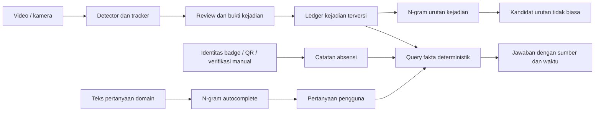

# N-gram Academic Lab — rencana pengembangan

> **Status implementasi dan pilot, 10 Oktober 2026.** Registry/checkpoint v2, WB/MKN/EM, grouped document research, bootstrap/diagnostics/benchmark, autocomplete, lab browser, ledger dan absensi manual tersedia. Tiga pilot dan 72 benchmark model selesai. Blueprint berikut tetap memuat gate yang belum semuanya tercapai; lihat [checklist](todo.md), [hasil pilot](../../extensions/README.md) dan [verifikasi](../../extensions/reports/VERIFICATION.md).

## Hasil dan gerbang yang masih terbuka

Brown/Reuters menggunakan 120 dokumen pertama menurut sorted file IDs; Indonesia 40 introduction Wikipedia CC BY-SA 4.0. Delapan metode orde 1–3 dipilih dev, vocabulary train-only, test sekali per model. Brown/Reuters memilih trigram MKN, PP 280,825/93,561; Indonesia memilih bigram KN PP 84,613. Independent source test groups hanya 11/12/4. Prior exposure tidak diketahui; hasil ini bukan konfirmasi pada corpus eksternal independen.

CI target dikoreksi dari losses tersimpan karena group tags target tidak terbawa pada runner frozen; model tidak dievaluasi ulang. Delapan source files diarsipkan dengan hash sebelum fix untuk run berikutnya. Benchmark mengukur seluruh worker peak memory, single CPU dan warmup/repeats; full MRR mencakup OOV dan berbeda dari MRR@50. Metode baru tidak selalu menang atau memperbaiki autocomplete.

Lab, ledger, adapter sequence dan novelty offline telah diimplementasikan. **Kualitas novelty nyata/exposure/onset, holdout konfirmatori independen, face/liveness, scanner badge/QR, causal CCTV live dan temporal/subject-filtered chat bebas belum terbukti atau belum didukung.** Absensi diverifikasi manual admin. Piksel tetap diproses detector/tracker; N-gram menerima kata atau simbol setelah review. Coverage akademik 80,83% line+branch bukan akurasi AI atau coverage seluruh repo.

[Mulai membaca](#tujuan-dan-batas) · [Hubungan dengan CCTV](#hubungan-n-gram-cctv-dan-absensi) · [Fase kerja](#urutan-implementasi) · [Tools](#tools-dan-setup) · [Protokol ilmiah](#protokol-eksperimen) · [Bukti setup](#snapshot-setup-awal-10-oktober-2026-historis)

## Tujuan dan batas

Pengembangan N-gram akademik dilanjutkan sesuai permintaan terbaru pengguna. Tujuannya sebuah **laboratorium model bahasa statistik yang dapat dijelaskan, diuji, dan direproduksi**, kemudian dipakai sebagai salah satu komponen Video Insight. “Maksimal” berarti kedalaman metode, pembuktian, eksperimen, dan kegunaan; jumlah fitur bukan ukuran mutu ilmiah.

Bagian akademik tetap mengikuti [spesifikasi tugas](../../SPESIFIKASI_TUGAS.md): implementasi N-gram sendiri, tuning hanya pada dev, test untuk evaluasi akhir, serta pemisahan `core/` dan `extensions/`. Semua 16 langkah core dan hasil asli dipertahankan. Tidak ada konversi N-gram menjadi YOLO, Qwen, atau pengenal wajah.

Hasil yang dituju:

- Model probabilistik dengan Modified Kneser–Ney, Witten–Bell, dan bobot interpolasi yang dipelajari pada dev, dibandingkan dengan baseline lama.
- Eksperimen dengan sumber data, split, ketidakpastian, domain shift, kualitas generasi, dan biaya CPU/memori yang dapat diaudit.
- Lab edukasi yang memperlihatkan hitungan dan rumus; autocomplete Indonesia/domain yang manfaatnya diukur.
- Jembatan terpisah ke kejadian CCTV dan catatan absensi terverifikasi. Keberhasilan akademik tidak bergantung pada implementasi biometrik.

**Urutan prioritas:** keselamatan eksperimen → kebenaran matematika → bukti empiris → penjelasan interaktif → aplikasi domain. Tidak mensyaratkan metode baru selalu menang; hasil negatif yang terukur tetap hasil ilmiah.

## Fondasi yang sudah tersedia

Inventaris diperbarui dari source dan hasil pilot pada 10 Oktober 2026.

| Bagian | Implementasi saat ini | Batas saat ini |
| --- | --- | --- |
| Core | MLE/Laplace, notebook 16 langkah, tes, manifest SHA-256 | Dibekukan; bukan lokasi perubahan |
| Smoothing extensions | Lima baseline + Witten–Bell/MKN/EM; n=1–4 | Pilot n=1–3; NLTK memvalidasi ordinary KN saja |
| Evaluasi | Train-only vocabulary, grouped document split, dev tuning dan receipts | Pilot exploratory; prior exposure unknown; hasil lama terpisah |
| Diagnostik | Grouped bootstrap, frequency/length/genre, entropy/generation dan native peak RSS | Sampel kecil; diversity bukan koherensi, latency lokal |
| Validasi | Hitungan mini/manual, normalisasi, perbandingan ordinary KN terhadap NLTK | NLTK ordinary KN bukan pembanding MKN |
| CLI | train/evaluate/generate/score/info/list; checkpoint v2 + sidecar | v1 ketat; live code berbeda menolak recomputation run lama |
| Studio video | Lab Python, ledger review, absensi manual dan novelty offline | Track bukan identitas; kualitas nyata/temporal bebas belum terbukti |

Rencana lama CCTV di [tasks/plan.md](../plan.md) tetap menjadi catatan jalur video. Checklist lama tidak dibuang atau dianggap selesai akibat rencana baru ini.

## Hubungan N-gram, CCTV, dan absensi

N-gram memprediksi token berikutnya dari beberapa token sebelumnya. Pada teks, token adalah kata. Pada CCTV, **setelah** gambar dianalisis, token dapat berupa simbol kejadian. N-gram tidak mengetahui piksel, wajah, posisi kotak, atau plat tanpa komponen pengamatan lain.



| Kebutuhan | Komponen yang berwenang | Peran N-gram |
| --- | --- | --- |
| Kotak orang, kendaraan, helm | YOLO + tracker + review | Tidak menggambar kotak |
| “Ada berapa orang?” | Query atas observasi/kejadian yang terdefinisi | Membantu melengkapi pertanyaan; tidak menebak angka |
| Urutan kejadian jarang | Model urutan simbol dari kejadian terverifikasi | Menghitung peluang/surprisal sebagai kandidat tinjauan |
| “Siapa datang pukul 08.00?” | Catatan identitas dan absensi terverifikasi | Membantu input pertanyaan; fakta berasal dari catatan |
| Wajah, foto palsu, topeng, occlusion | Sistem biometrik/liveness terpisah | Tidak mengenali wajah atau membuktikan kehadiran |

**Contoh teks:** setelah “berapa orang yang”, trigram memilih kata berdasarkan dua kata terakhir. Lab menampilkan `P(kata | konteks)`, sumber counts, dan kata alternatif.

**Contoh CCTV:** `PERSON_ENTER_ZONE → HELMET_UNKNOWN → PERSON_EXIT_ZONE`. Model dapat menyatakan bahwa urutan tersebut jarang pada data training. “Jarang” tidak sama dengan berbahaya, pelanggaran, atau orang tanpa helm. `HELMET_UNKNOWN` berarti pengamatan belum memadai; keputusan deteksi perlu label/bukti sendiri.

**Contoh absensi:** badge/QR yang sah dapat menghubungkan catatan kedatangan ke pegawai tertentu. Track ID tetap ID pengamatan dalam rekaman, bukan ID pegawai. Kotak dengan nama manual juga tidak otomatis menjadi bukti identitas. Relasi ambigu dikembalikan sebagai “belum diketahui”.

Simpan ID orang, rekaman, revisi, dan sumber pada metadata. Jangan menjadikan nama/ID sebagai token prediksi. Simbol kejadian memiliki tokenizer dan kebijakan boundary **tersendiri** di extensions; preprocessing alfabetik akademik tidak boleh dipakai diam-diam karena dapat menghilangkan underscore, angka, dan ID.

## Keputusan arsitektur

| Keputusan | Alasan |
| --- | --- |
| Pertahankan core dan baseline lama | Memastikan tugas awal dan hasil historis tetap dapat diperiksa |
| Algoritme/protokol baru di `extensions/` | Mengikuti pembekuan core tanpa menduplikasi fondasi |
| Run baru memakai direktori eksklusif `extensions/results/runs/<run_id>/` | Mencegah overwrite hasil, memudahkan resume dan provenance |
| Checkpoint v1 tetap ketat; schema baru hanya v2 | Menjaga pembacaan model lama dan validasi batas input |
| N-gram berjalan pada CPU | Counts, lookup, dan EM kecil tidak memerlukan PyTorch/CUDA; GPU tetap relevan untuk detector/LLM |
| Lab memakai stack React/TypeScript studio yang sudah ada | Satu pola UI, autentikasi, dan aksesibilitas; belum perlu Streamlit/Gradio atau landing page |
| Adapter lab menyediakan score/top-k saja dan membaca run yang tervalidasi | Browser tidak mengimpor algoritme Python; model/data bukan input path bebas dari pengguna |
| Root dan studio tetap memiliki environment/lock masing-masing | Paket N-gram dipasang sebagai dependency lokal terkunci pada fase integrasi, setelah cek kompatibilitas; tidak memakai mutasi `sys.path` sebagai integrasi permanen |
| Ledger kejadian memakai SQLite melalui backend yang sudah ada | Cukup untuk portofolio lokal; gunakan transaksi, constraint dan provenance sebelum mempertimbangkan PostgreSQL |
| Fakta dijawab dengan query yang tervalidasi | Prediksi N-gram maupun kalimat Qwen tidak menjadi sumber angka/identitas |

Ledger observasi memakai schema SQLite tersendiri dengan constraints dan audit; catatan keamanan bukan ground truth kejadian. Data pribadi tidak disimpan pada manifest publik. Lisensi corpus, detector, dan model tetap dicatat sesuai [NOTICE](../../NOTICE.md).

## Urutan implementasi

Fase adalah urutan dependency, bukan perkiraan tanggal. Satu task pada checklist harus dapat diselesaikan dan diperiksa dalam satu sesi terfokus. Tabel berikut adalah blueprint dependency dan gate; status implementasi aktual di atas dan checklist membedakan implementation dari validasi domain.

| Fase | Hasil yang dapat digunakan | Task | Gerbang sebelum lanjut |
| --- | --- | --- | --- |
| **0 — Persiapan** | Environment terkunci, alat uji dan inventaris baseline | 0.1–0.3 | Test/lint/typecheck/build dan hash baseline lulus |
| **1 — Eksperimen aman** | Run registry, CLI score/info, checkpoint v2 | 1.1–1.4 | Tidak ada overwrite; v1 kompatibel; error input teruji |
| **2 — Metode kuat** | Witten–Bell, MKN, interpolasi EM | 2.1–2.3 | Rumus, contoh independen, normalisasi, EM monotonicity lulus |
| **3 — Evaluasi yang adil** | Dataset berprovenance, grouped split, domain shift | 3.1–3.3 | Protokol dibekukan; tidak ada leakage atau pemilihan lewat test |
| **4 — Analisis dan biaya** | Interval ketidakpastian, error/generasi, benchmark CPU | 4.1–4.3 | Metrik dan biaya dibandingkan pada target yang sama |
| **5 — Lab edukasi** | Playground, probability explorer, experiment lab | 5.1–5.3 | Nilai UI cocok dengan Python; keyboard/mobile/reduced motion lulus |
| **6 — Aplikasi bahasa dan laporan** | Autocomplete domain dan paket akademik lengkap | 6.1–6.3 | Baseline, coverage/OOV, latency, laporan dan reproduksi terverifikasi |
| **7 — Jembatan CCTV** | Ledger kejadian dan eksperimen urutan offline | 7.1–7.3 | Provenance/revisi aman; split per rekaman; false alert terukur |
| **8 — Jembatan absensi** | Identitas terverifikasi dan jawaban berbukti | 8.1–8.2 | ID bukan tebakan; unknown dan isolasi akses teruji |

**Paket akademik kuat selesai pada fase 6.** Fase 7–8 menunjukkan hubungan praktis ke studio. Pengenalan wajah dan liveness merupakan proyek lanjutan, dengan dataset berizin dan evaluasi tersendiri; belum menjadi task implementasi rencana ini.

### Fase 1: lindungi eksperimen sebelum menambah metode

Runner lama memakai output tetap di `extensions/results/`. Sebagian entry point menolak file hasil yang sudah ada, tetapi penulis JSON/CSV/gambar masih menggunakan path tetap. Jangan menjalankan ulang rangkaian eksperimen lama untuk peningkatan ini, dan jangan memindahkan hasil lama agar runner bisa berjalan.

Registry baru harus membuat direktori secara eksklusif, menyimpan config, versi algoritme/preprocessing, fingerprint corpus, split group IDs, vocabulary policy, versi dependency, seed, jejak tuning, final model, dan status. Tulis output atomik; run gagal tetap ditandai gagal, bukan menjadi hasil lengkap. CLI metadata membaca sidecar terbatas tanpa memuat seluruh counts. Resume hanya untuk config/split/fingerprint yang cocok; hasil final test yang sudah tercatat dipakai ulang, bukan dihitung setelah mengubah model.

### Fase 2: kontrak matematika

Untuk setiap model probabilistik: nilai finite/nonnegatif, total peluang 1 pada vocabulary prediksi untuk konteks terlihat/tidak terlihat, serta BOS/EOS/UNK yang eksplisit. Stupid Backoff tetap skor ranking tanpa PP probabilistik.

**Witten–Bell:** interpolated Witten–Bell, bobot hitungan konteks `N/(N+T)` dan massa lower-order `T/(N+T)`, dengan `T` jumlah successor types. Tentukan distribusi dasar dan full backoff untuk konteks kosong; dokumentasikan fallback unigram/UNK. Jangan mencampurkan varian interpolated dan reserved-unseen-mass tanpa penamaan.

**Modified Kneser–Ney:** orde tertinggi memakai raw token counts; orde lebih rendah memakai distinct-left-context continuation effective counts. Count-of-counts dan estimator diskon dihitung per orde dari effective counts tersebut:

\[
Y=\frac{N_1}{N_1+2N_2},\quad
D_1=1-2Y\frac{N_2}{N_1},\quad
D_2=2-3Y\frac{N_3}{N_2},\quad
D_{3+}=3-4Y\frac{N_4}{N_3}.
\]

Massa backoff per konteks harus sesuai bucket successor types:

\[
\lambda(h)=\frac{D_1N_1(h*)+D_2N_2(h*)+D_{3+}N_{3+}(h*)}
{\sum_w c_{\mathrm{eff}}(hw)}.
\]

Bucket kosong atau diskon invalid memakai fallback yang ditetapkan sebelum eksperimen dan dicatat pada manifest, bukan division-by-zero atau clipping tersembunyi. Floor/epsilon mengubah model; catat formulanya. Uji contoh finite yang diturunkan secara independen. Tes existing NLTK KN memvalidasi **ordinary KN saja**, bukan MKN. Perbandingan MKN eksternal hanya diklaim jika padding/vocabulary/count semantics cocok.

**EM interpolation:** komponen probabilitas tetap, bobot global dioptimalkan memakai frekuensi token dev:

\[
r_j(e)=\frac{\lambda_jp_j(e)}{\sum_l\lambda_lp_l(e)},\qquad
\lambda'_j=\frac{\sum_e c(e)r_j(e)}{\sum_e c(e)}.
\]

Bobot nonnegatif dan berjumlah 1; log-likelihood dev tidak menurun melebihi toleransi numerik. Simpan tolerance, iteration cap, initialization, zero-denominator policy, dan trace. Dev yang dipakai fitting tidak dilaporkan sebagai generalisasi. Bobot per bucket konteks menunggu bukti kebutuhan karena menambah risiko overfit.

### Fase 3–4: jawaban penelitian yang ingin diperoleh

1. Apakah MKN/EM mengurangi token-weighted cross-entropy pada target yang sama dibanding KN/preset lama?
2. Bagaimana performa berubah menurut frekuensi, panjang, genre, OOV, dan perpindahan domain?
3. Berapa biaya memori, build, scoring dan top-k untuk manfaat tersebut?
4. Apakah diversity/repetisi generasi berubah, dan apakah perbaikan statistik cukup untuk mendukung klaim yang dibuat?

Brown menjadi baseline kontinuitas; Reuters menilai domain shift, bukan menggantikan baseline. Dataset Indonesia pilot dipilih setelah lisensi API Wikipedia, dokumentasi dan grouping diperiksa. Tidak mengambil teks pribadi/percakapan pengguna secara otomatis.

### Fase 5–6: lab dan penggunaan bahasa

Tiga panel menjelaskan mekanisme, bukan sekadar kartu angka:

- **Playground:** input konteks → top-k kata dengan peluang → generate token demi token, menyorot sliding context n−1 kata. Seed dan alasan berhenti terlihat.
- **Probability Explorer:** count/denominator, P, log P, kontribusi NLL tiap token, LL/PP kalimat; contoh underflow perkalian dibanding log-sum, dengan formula dan substitusi angka.
- **Experiment Lab:** metode × orde, filter corpus/split/vocabulary policy/run, detail dev trials, interval perbandingan dan validasi NLTK. PP N/A ditampilkan jelas untuk skor tak ternormalisasi.

Tetap sederhana, langsung lab/dashboard. Formula dapat dilipat, label “implementasi sendiri tanpa library N-gram eksternal” dan “NLTK sebagai validasi” tetap tersedia. Backend tidak menerima path/model upload bebas; endpoint memiliki input limits, auth, isolasi workspace, dan model lifecycle yang teruji. Lab tidak menjalankan evaluasi final test ketika pengguna mengubah slider.

Autocomplete menggunakan teks Indonesia/domain yang berizin, split per dokumen/template-family, normalisasi versi tersendiri, dan suffix/prefix policy yang dijelaskan. Ukur top-1/top-3/top-5, MRR, OOV/coverage, p50/p95 CPU latency serta memori terhadap unigram dan ordinary KN. Prediksi hanya membantu menulis pertanyaan, bukan mengisi nama, plat, atau jumlah dalam jawaban.

### Fase 7–8: aplikasi urutan dan fakta

Ledger menyimpan workspace, source recording/session, timestamp dan timezone, track scope, jenis kejadian, status pengamatan/review, confidence, model version, correction revision, evidence reference dan sumber identitas bila sah. Konsumsi hanya revisi yang disahkan; draft/auto-label tidak menjadi ground truth. Koreksi harus menginvalidasi turunan yang stale, dengan jejak lineage; hasil asli tetap tersedia.

Eventization ditetapkan sebelum modelling: zona/line crossing, deduplikasi, debounce, urutan deterministik untuk kejadian simultan, session boundary, `CAMERA_GAP`, `HELMET_UNKNOWN`, dan bin durasi yang dipelajari dari training. Jangan memakai satu token per frame yang menggembungkan hitungan karena FPS.

Unit sequence awal adalah **per observed track dalam satu recording/session**, dengan simbol yang berlaku untuk kelas objek tersebut. Event dua track berbeda tidak digabung menjadi satu perjalanan orang/kendaraan. Fixture `ENTER(A), HELMET_UNKNOWN(B), EXIT(A)` harus menghasilkan sequence A dan B terpisah. ID tetap metadata; track yang pecah/ambigu tidak disambung diam-diam. Model agregat scene/session kelak memakai taxonomy dan evaluasi terpisah, bukan dianggap trajectory individu.

Model kejadian memakai sequence boundaries dan alphabet tersendiri. Seluruh frame/crop/export/window dari satu rekaman masuk satu split; uji future-time dan unseen camera/site secara terpisah. Threshold alarm dipilih pada calibration/dev. Jika tidak ada episode berlabel independen, hasil hanya diagnostik novelty, bukan klaim deteksi anomali tervalidasi. Bila tersedia, laporkan precision/recall episode, false alerts per jam, detection delay, dan jumlah rekaman/kondisi. Bandingkan unigram/frequency threshold, bigram dan model terbaik yang dipilih pada dev.

Tahap awal **offline replay**. Tracker retrospektif dapat memakai frame masa depan; jangan menyebutnya live/real-time sebelum causal replay dan latency end-to-end diverifikasi.

Absensi awal memakai badge/QR atau relasi manual yang diverifikasi dan terbatas waktu/rekaman. Query deterministik menangani waktu/timezone, duplikat, koreksi/retraksi, ambiguitas, dan akses workspace. Sistem menampilkan sumber saat menjawab; LLM boleh merangkai bahasa, tetapi tidak mengubah nilai fakta. Kehadiran di satu timestamp bukan bukti hadir satu shift penuh.

## Protokol eksperimen

| Aturan | Pelaksanaan |
| --- | --- |
| Lindungi hasil asli | SHA-256 sebelum/sesudah; run baru hanya di direktori eksklusif |
| Train/dev/test jelas | Vocabulary/counts/discount statistics/bin/pruning fit train; bobot/hyperparameter/threshold dipilih dev; model/protokol dibekukan sebelum final test |
| Sekali test per final model | Registry mencatat artifact+split fingerprint dan receipt; pengulangan reproduksi tidak menjadi kesempatan retuning |
| Test historis sudah terlihat | Grid lama tetap historical/exploratory; fresh reserved sources/groups untuk klaim konfirmatori baru |
| Split kuat | Group per dokumen/sumber, duplikat dan near-duplicate lintas split dicegah; split core tetap utuh |
| PP sebanding | Sama tokenizer, vocabulary/UNK, padding dan target events; jangan ranking gabungan lintas `min_count` atau BPE neural |
| Agregasi benar | CE = total NLL / jumlah target token; PP = exp(CE), dengan log natural konsisten; bukan rata-rata PP kalimat |
| Ketidakpastian | Paired per-document NLL differences dan grouped bootstrap CI 95%; seed berbagi corpus bukan observasi independen |
| Refitting opsional | Train+dev hanya jika prosedur fit ulang vocabulary/counts/discount telah diregistrasi sebelum test; default tetap train-only |
| Domain shift | Frozen source model dinilai pada target dengan mapping source vocab; adaptation dibandingkan pada held-out target yang sama |
| Batas klaim | Diversity bukan ukuran koherensi; novelty bukan bahaya; track ID bukan identitas; coverage tes bukan akurasi AI |

Karena laporan/test lama sudah dianalisis, mengganti seed pada corpus yang sama tidak membuat test kembali “belum pernah dilihat”. Jika sumber holdout baru belum tersedia, beri label eksploratif dan jangan menunggu data untuk memverifikasi rumus/CLI.

## Tools dan setup

Instalasi dilakukan pada root `.venv` melalui uv, tanpa instalasi global baru. Existing dependency runtime tetap pada versi lock semula.

| Tool | Versi diverifikasi | Fungsi / tindakan turn ini |
| --- | --- | --- |
| Python | 3.11.15 | Runtime yang sudah ada |
| uv | 0.11.23 | Sync environment dan lock |
| pytest / pytest-cov / coverage | 9.1.1 / 7.1.0 / 7.16.2 | `pytest-cov` ditambahkan ke dev; coverage sebagai dependency tool |
| Ruff / Ty | 0.16.10 / 0.0.84 | Lint/format dan type-check existing |
| NLTK / NumPy | 3.10.3 / 2.4.6 | Corpus/reference dan perhitungan existing |
| pandas / Matplotlib / PyYAML | 3.0.6 / 3.11.2 / 6.0.3 | Analisis, grafik dan config existing |
| nbclient / nbformat / ipykernel | 0.11.0 / 5.11.1 / 7.4.0 | Notebook existing |
| build | 1.6.1 | Tool paket existing; wheel/sdist dibangun lewat `uv build` |
| React / TypeScript | 19.3.0 / 5.9.3 pada lock studio | Digunakan kembali ketika lab diimplementasikan; tidak dipasang ulang turn ini |

Lock menambahkan `tomli` sebagai dependency kondisional coverage; tidak terpasang pada Python 3.11 yang memakai `tomllib`. Pada snapshot setup awal, Brown sudah tercache dan Reuters belum diunduh. Keduanya kini tersedia lokal untuk pilot; loader cache zip diuji tanpa download.

Tidak perlu KenLM/C++/WSL, framework deep learning baru, atau GPU untuk fase N-gram ini. Bootstrap, EM, Witten–Bell, MKN dan registry dapat memakai stdlib/NumPy yang sudah tersedia. Reference eksternal tambahan hanya dipasang jika semantics dan kebutuhan benchmark jelas.

### Command setup dan verifikasi

Jalankan dari root repository; `setup_lokal.ps1` mengarahkan cache/temp ke workspace. Dependency tools tercatat pada dev group dan `uv.lock`.

```powershell
. .\setup_lokal.ps1
uv sync --locked --group dev
uv run --locked pytest -q --cov=core.src --cov=extensions.src --cov-branch --cov-report=term-missing --cov-report=json:.tmp/ngram-plan/coverage.json --cov-report=html:.tmp/ngram-plan/coverage
uv run --locked ruff check core extensions jalankan_notebook.py
uv run --locked ruff format --check core extensions jalankan_notebook.py
uv run --locked ty check core/src extensions/src extensions/experiments jalankan_notebook.py
uv run --locked ngram-lm --help
uv build --out-dir .tmp/ngram-plan/packages
git diff --check
```

`[tool.coverage.run]` menyimpan database coverage pada `.tmp/.coverage`. HTML/JSON juga berada dalam `.tmp`. Tidak menjalankan notebook atau runner historis pada setup ini karena keduanya dapat menulis artefak hasil.

## Snapshot setup awal, 10 Oktober 2026 (historis)

| Pemeriksaan yang benar-benar dijalankan | Hasil |
| --- | --- |
| `uv add --group dev pytest-cov` lalu `uv sync --locked --group dev` | Sukses; runtime scientific dependency lama tidak berubah versi |
| `pytest` core + extensions dengan branch coverage | **48 passed**, 2,24 detik pada run akhir (run pertama 8,84 detik) |
| Coverage source akademik | Gabungan line+branch **67,57%** (display 68%); line 72,18%, branch 54,85% |
| Ruff check + format check | Lulus; 31 file sudah sesuai format |
| Ty pada source/experiments/runner notebook | Lulus |
| `ngram-lm --help` | Lulus; hanya command existing train/evaluate/generate |
| `uv build` | Wheel dan sdist berhasil dibuat |

Coverage rendah pada CLI/pipeline menunjukkan jalur yang belum dicakup tes unit, termasuk jalur corpus/full command; bukan bukti bahwa jalur tersebut pasti rusak. Fase 1–3 menambahkan tes pada input/output, kegagalan, selection leakage dan serialization yang material. Tidak mengubah core untuk mengejar angka coverage, dan tidak memasang threshold keseluruhan 100% yang tidak berbasis risiko.

Command coverage pertama salah memakai `$PSScriptRoot` pada shell interaktif sehingga data file jatuh ke root. Tes/HTML/JSON tetap berhasil; database dipindahkan secara terarah ke `.tmp/.coverage`, dan config default diverifikasi menunjuk path tersebut. Tidak ada penulisan cache di luar repository.

Snapshot sebelum setup: `.tmp/ngram-plan/protected-before.json` mencakup **188 berkas** core, hasil extensions, hasil demonstrasi, verifikasi, dan berkas pengguna yang dilindungi. Pemeriksaan akhir dicatat pada `.tmp/ngram-plan/verification.json`. Cakupan hash ini bukan audit ulang seluruh runtime studio; setup ini tidak memodifikasi source/bobot/video studio.

## Kapan rencana dianggap tercapai

**Akademik:** fase 1–6 lulus gate; rumus dan tes independen tersedia; run terisolasi dapat direproduksi; laporan memisahkan hasil lama/baru, dev/test dan hasil negatif; lab menampilkan angka nyata; autocomplete dinilai terhadap baseline.

**Integrasi:** fase 7–8 lulus tes provenance, revisi, unknown, akses, replay dan metrik domain. Absensi biometrik serta deployment pabrik tidak diklaim dari portofolio lokal.

CI yang sudah ada tetap dipakai. Tambahan coverage/checkpoint/leakage checks dilakukan setelah fiturnya ada; eksperimen berat dipisahkan dari CI cepat dengan sumber/fingerprint tetap. Test final tidak otomatis dijalankan ulang sebagai tuning pada setiap commit. Source/docs penting dapat dipublikasi setelah verifikasi; video pribadi, identitas, model lokal dan cache tetap lokal.

## Referensi dan keputusan yang perlu dikunci saat eksekusi

- [Spesifikasi tugas](../../SPESIFIKASI_TUGAS.md) — batas core, metode, protokol dan laporan.
- [Jurafsky & Martin, Speech and Language Processing](https://web.stanford.edu/~jurafsky/slp3/) — model bahasa, smoothing, entropy/perplexity; gunakan versi bab yang dicatat saat implementasi.
- [Chen & Goodman, ACL 1996](https://aclanthology.org/P96-1041/) — metadata publikasi smoothing terverifikasi. Detail estimator MKN perlu ditautkan ke sumber teknis Chen & Goodman yang tepat pada task 2.2; akses otomatis locator Harvard ditolak robots.txt pada turn ini, sehingga laporan 1998 belum diklaim terverifikasi lewat locator tersebut.
- [Dokumentasi pytest-cov](https://pytest-cov.readthedocs.io/en/latest/reporting.html) — output HTML/JSON dan path laporan.
- [Dokumentasi uv](https://docs.astral.sh/uv/concepts/projects/dependencies/) — dependency groups dan sinkronisasi lock.

Sumber Indonesia pilot sudah dipilih dan diunduh berizin. Holdout konfirmatori baru serta dataset kejadian berlabel independen masih memerlukan license/provenance, exposure/onset dan evaluasi. Tidak menghalangi fase 1–2. Target latency, ukuran corpus dan false-alert budget dikunci setelah pilot **train/dev**, sebelum test. Tidak ada angka target yang dipresentasikan sebagai hasil tercapai.
