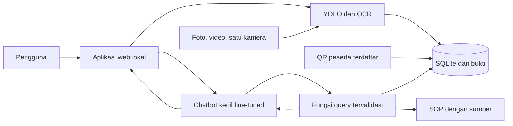

# Rencana Chatbot dan Deteksi Visual Lokal

Tanggal: 8 Oktober 2026. Target: **demonstrasi/portofolio lokal dulu**.
Status: implementasi prototipe video + chat lokal diizinkan pengguna pada 8 Oktober 2026.
Panduan aktual: [README aplikasi](../industrial_ai/README.md). Demo upload/tracking/chat/koreksi telah diuji; [verifikasi publik](../industrial_ai/reports/VERIFIKASI_PUBLIK.md) dan [status implementasi](todo.md#status-demo-lokal--8-oktober-2026) mencatat hasil. Gate formal roadmap tetap terpisah dari smoke test prototipe.
Checklist eksekusi: [todo.md](todo.md).

## 1. Cara memakai dokumen

Baca skenario, persiapan, lalu roadmap. Jalankan task pada todo.md sesuai dependensi;
beri centang setelah verifikasi dan simpan command aktual, exit code, output dan versi.
Angka target di sini adalah usulan kriteria proyek, bukan hasil pengujian.

Dokumentasi awal sudah dibuat. Pengguna kemudian meminta implementasi unggah video
dengan dua pemutar (asli dan tracking AI), hasil analisis, serta chatbot. Prototipe
ini memakai YOLO pretrained, per-video JSON, dan model chat kecil dengan LoRA pilot.
Kamera langsung, OCR plat, identitas wajah, absensi, serta seluruh gate akurasi dan
roadmap lanjutan belum menjadi kemampuan prototipe saat ini.

## 2. Tujuan dan keputusan pengguna

Satu aplikasi lokal untuk percakapan AI, deteksi helm, tinjauan bukti kejadian,
pembacaan plat, dan absensi. Chatbot mengambil data yang tersimpan untuk menjawab.
Milestone aktif: **unggah video -> dua pemutar sinkron -> tracking/helm -> hasil/bukti -> tanya AI**.
Input foto tetap menjadi target lanjutan.
Berikutnya: satu kamera langsung seperti CCTV, foto kendaraan/crop plat, lalu absensi.
Arahan tambahan pengguna: kotak orang mengikuti objek, hijau saat helm yang dipantau
terdeteksi dipakai, merah saat kekurangan terdeteksi; jumlah orang/mobil dapat ditanya.
Identifikasi wajah dengan nama/ID peserta terdaftar menjadi pengembangan opsional.

Pengguna menyepakati arah chatbot dengan model kecil fine-tuned, kombinasi deteksi,
dokumentasi berfase, dan target portofolio lokal. Pilihan model, framework, QR,
jumlah data, serta ambang kualitas di bawah adalah rekomendasi teknis awal.

Penguatan N-gram sebelumnya dihentikan. Lampiran
Roadmap_Pengembangan_N-Gram_AI_Engine.md dipakai sebagai referensi, bukan instruksi
training dari nol. Model chatbot menggunakan pretrained instruction model.
N-gram tetap menjadi artefak akademik; bobotnya tidak dapat dikonversi langsung
menjadi LLM atau detektor gambar.

Hasil akhir roadmap adalah portofolio yang dapat direproduksi pada perangkat yang
diuji. Penggunaan operasional pabrik memerlukan validasi lokasi tersendiri.

## 3. Skenario penggunaan

Contoh berikut adalah skenario yang diinginkan, bukan hasil deteksi nyata.

| ID | Aksi pengguna | Hasil yang diharapkan | Fase |
| --- | --- | --- | --- |
| S01 | Mengobrol dan bertanya tentang proyek | Percakapan Bahasa Indonesia dengan konteks sesi, tanpa mengarang catatan operasional | 3 |
| S02 | Mengunggah foto pekerja | Box berwarna + label/track ID: hijau helm terdeteksi, merah tanpa helm, kuning belum jelas; bukti dan versi model | 2, 4 |
| S03 | Mengunggah video dan bertanya jumlah orang | Video hasil dengan kotak mengikuti orang, jumlah yang terlihat/lintasan lewat sesuai definisi, kejadian tanpa helm dan ID tracking sementara | 2, 4 |
| S04 | Bertanya jumlah kejadian atau siapa tanpa helm | Jumlah sesuai waktu/sumber/status, ID tracking dan bukti; nama hanya tersedia setelah identitas terdaftar terverifikasi | 4 |
| S05 | Bertanya lanjut: tampilkan buktinya | Bukti dari filter/sesi yang sama dengan timestamp dan sumber | 4 |
| S06 | Menyalakan satu webcam lokal | Tampilan CCTV dengan kotak/label/status, jumlah yang terlihat, lintasan masuk/keluar, kejadian baru dan status koneksi | 5 |
| S07 | Mengunggah kendaraan/video gerbang | Tracking mobil, snapshot kendaraan yang terlihat utuh, panel zoom/crop plat dari frame sumber, OCR dan waktu | 6 |
| S08 | Menanyakan plat dan berapa mobil lewat | Jumlah lintasan mobil pada garis/arah/rentang yang dipilih, foto kendaraan dan crop plat; OCR ragu ditandai | 6 |
| S09 | Peserta terdaftar memindai QR | Identitas registry, waktu, shift, transaksi check-in/out | 7 |
| S10 | Menanyakan siapa belum check-in | Perbandingan roster shift dengan transaksi, beserta waktu pembaruan | 7 |
| S11 | Bertanya tentang SOP yang diimpor | Jawaban dan kutipan dengan sumber/bagian dokumen | 4 |
| S12 | Kamera putus atau data belum ada | Periode tanpa rekaman terlihat; data kosong tidak disamakan dengan nol kejadian | 4, 5 |

Demo MVP: buka aplikasi, unggah video independen dari training, periksa deteksi,
tinjau kandidat, tanyakan ringkasan, lalu buka bukti. Chat biasa tetap tersedia
ketika kamera mati.

## 4. Aturan kebenaran hasil

- Status helm: helmet, no_helmet, unknown. Tidak terlihatnya helm saja tidak cukup;
  kepala dan asosiasinya dengan pekerja harus jelas. Helm di tangan bukan helm dipakai.
- Status tinjauan: candidate, confirmed, dismissed. Deteksi menghasilkan kandidat;
  pengguna mengonfirmasi/menolak setelah melihat bukti, dengan audit koreksi.
- Jumlah kejadian berbeda dari orang unik. ID tracker dibatasi sumber dan sesi,
  serta tidak memberikan nama karyawan. Sebelum fitur wajah, siapa tanpa helm
  dijawab dengan ID tracking/sesi, waktu dan bukti; nama tidak ditebak.
- Warna status selalu disertai label/ikon: hijau untuk helm yang terdeteksi dipakai,
  merah untuk no_helmet, kuning untuk unknown. Hijau hanya mencakup alat yang memang
  dipantau; fase awal helm, bukan klaim bahwa seluruh APD lengkap. Status review
  candidate/confirmed tetap terpisah dari warna prediksi.
- Jumlah terlihat dihitung pada frame/waktu yang disebut. Jumlah lewat dihitung dari
  lintasan track yang melintasi garis/region dan arah yang dikonfigurasi. ID track
  bukan jaminan orang unik; putus tracking/re-entry diuji dan batasnya dilaporkan.
- Orang diam tetap dapat dideteksi; gerakan membantu tracking, bukan syarat deteksi.
- Mapping kelas dibaca dari masing-masing checkpoint; ID kelas COCO tidak dipakai
  sembarang pada checkpoint custom helm/plat.
- Foto menghasilkan kandidat tanpa aturan durasi video. Hipotesis video awal:
  bukti konsisten 2 detik, event berakhir setelah 5 detik tidak terlihat. Parameter
  ditetapkan dari validation set; occlusion/association ambigu menjadi unknown.
- Simpan interval, sumber/sesi, bukti, status, dan versi model. Skor confidence
  bukan probabilitas yang sudah terkalibrasi.
- Simpan waktu UTC, tampilkan Asia/Jakarta. Hari ini memakai batas tanggal Jakarta;
  rentang ambigu meminta klarifikasi. Untuk video unggahan, simpan posisi menit/detik
  dan pisahkan waktu analisis dari waktu perekaman. Jika waktu perekaman tidak diketahui,
  gunakan offset video; waktu upload tidak dianggap waktu kejadian secara otomatis.
- Jawaban jumlah menyebut rentang, sumber, status tinjauan dan satuan kejadian.
  Kamera putus, laju sampling dan dropped frames dilaporkan bila relevan.
- Model mengusulkan nama fungsi/argumen. Backend memvalidasi dan menjalankan fungsi
  yang diizinkan dengan query terparameterisasi; raw SQL model tidak dieksekusi.
- Angka berasal dari backend. Narasi yang bertentangan memakai ringkasan
  terverifikasi; mode/fallback dicatat. Akurasi sebelum fallback tetap diukur.
- OCR menyimpan teks mentah dan normalisasi; O/0 tidak diganti diam-diam.
  Pembacaan samar meminta tinjauan.
- Absensi memakai identitas registry. QR statis dapat disalin, sehingga scan QR
  sendiri tidak membuktikan pemiliknya hadir. Batas ini dinyatakan dalam demo.

## 5. Arsitektur dan pilihan awal

| Komponen | Rekomendasi awal | Alasan / jalur peningkatan |
| --- | --- | --- |
| Chatbot | Qwen/Qwen3-1.7B + LoRA via Transformers/PEFT | Pilihan prototipe CPU; pilot 32 dialog dan 6 evaluasi. Gate 100 prompt tetap diperlukan sebelum klaim kualitas luas |
| Helm | Prototipe: YOLO26n orang/mobil + YOLOv8n hard-hat pretrained terpisah | Fine-tuning YOLO26 custom tetap target fase 2 setelah dataset dan evaluasi independen tersedia |
| Mobil | YOLO26n pretrained COCO untuk kelas car | Checkpoint helm/plat tidak otomatis punya kelas mobil; counter Ultralytics dipakai bila memenuhi aturan counting |
| Plat | YOLO26n custom terpisah + Tesseract OCR | Lokasi dan teks diproses terpisah; OCR lain dipilih berdasarkan hasil test |
| Absensi | QR + peserta/roster/shift | Dapat didemokan tanpa biometrik; wajah memerlukan scope/evaluasi sendiri |
| Backend/UI | FastAPI + Jinja2 + HTML/CSS/JavaScript browser | Satu aplikasi Python tanpa build frontend Node pada versi awal |
| Data | SQLite stdlib + file bukti | Cukup untuk satu pengguna/kamera; naik ke server DB saat kebutuhan banyak penulis muncul |
| SOP | Markdown/teks + SQLite FTS5 | Kutipan mudah diperiksa; embedding ditambahkan bila evaluasi pencarian menunjukkan kebutuhan |
| Tracking | ByteTrack melalui Ultralytics | Asosiasi antarframe, dengan scope ID per sesi; bukan pengenal identitas |
| Training | LoRA; QLoRA bila backend quantization lulus smoke test | GPU dan kebutuhan memori diverifikasi dahulu |
| Serving | Base model + adapter hasil training | Sedikit komponen awal; GGUF/llama.cpp hanya jika profiling membenarkan dan ekspor diuji ulang |

Fine-tuning mengajarkan cara menjawab, bahasa, tugas dan format. SOP serta catatan
harian yang berubah tetap di dokumen/database, bukan dihafalkan sebagai data training.
Tambahkan dependency hanya pada fase yang membutuhkan: stack web pada fase 1/4,
vision pada 1/2, model bahasa pada 1/3, Tesseract executable pada fase 6. Versi paket
training tambahan dipilih setelah compatibility check dan dikunci di lockfile.

## 6. Kondisi repository dan perangkat

Repository saat ini: proyek N-gram Python 3.11, core/extensions, notebook, hasil,
dan ZIP pengumpulan. Snapshot ini dibuat sebelum dokumentasi/implementasi.
Aplikasi sekarang berada di industrial_ai/; baseline 208 file lama diperiksa terpisah.

Pemeriksaan read-only 8 Oktober 2026: ASUS TUF Gaming A14 FA401WV; AMD Ryzen AI 9
HX 370 (12 core/24 thread); RAM sekitar 31,1 GiB. CIM hanya menampilkan AMD Radeon
890M. NVIDIA/VRAM belum terverifikasi karena nvidia-smi ditolak izin. Tidak mengubah
permission atau mode GPU. RAM tersebut bukan jaminan kecepatan/training.

Subproyek usulan industrial_ai/ memiliki pyproject.toml, lockfile, environment,
app/, templates/, static/, training/, tests/, data/, models/, reports/, serta
.tmp/.cache/.uv-cache sendiri. Subproyek industrial_ai sekarang dibuat untuk prototipe; struktur data/cache tetap lokal.
Source, laporan, hasil dan ZIP N-gram dipertahankan; paket baru terpisah.
Bind awal 127.0.0.1, satu pengguna, satu worker model dan satu kamera. Pilih port
bebas; jangan mengubah konfigurasi asisten/layanan LLM pribadi yang ada.

## 7. Persiapan data dan perangkat

| Kebutuhan | Yang disiapkan | Fase |
| --- | --- | --- |
| Mesin/runtime | Laptop, charger saat training, ruang kosong usulan 20-30 GiB; cek ruang nyata, Python 3.11/uv, Torch build sesuai hardware | 1 |
| Helm | Dataset publik berlisensi, person/helmet/no_helmet, kasus sulit, video demo berizin | 1, 2 |
| Chatbot | Percakapan Bahasa Indonesia yang diperiksa, konteks, gaya jawaban, format fungsi, ketidakpastian dan follow-up | 3 |
| Dokumen | Penjelasan proyek dan SOP demo Markdown/teks yang jelas diberi label demo | 3, 4 |
| Kamera | Webcam laptop/USB satu sumber; RTSP opsional setelah webcam stabil | 5 |
| Plat/OCR | Frame kendaraan utuh + box plat/transkrip; video dengan lintasan mobil berlabel, sudut/cahaya dan plat Indonesia pada test; Tesseract/language data | 6 |
| Absensi | Peserta demo berizin dengan pseudonim/ID, roster, shift, QR unik, aturan check-in/out | 7 |
| Portofolio | Demo/screenshot run nyata, metrik, data/model cards, runbook, batas penggunaan | 8 |

Construction-PPE resmi dapat menjadi titik awal: dokumentasi mencatat 1.416 gambar,
termasuk helmet/no_helmet/Person. Audit semantik box dan simpan mapping tiga kelas
proyek. Data belum diunduh atau diaudit pada pekerjaan ini.

Usulan pilot helm: 500-1.500 gambar layak, tambah berdasarkan error validation.
Test final minimal 100 gambar independen dengan 50 instance no_helmet yang terlihat;
video terpisah dengan ground truth interval diperlukan untuk evaluasi kejadian.
Video unggahan untuk analisis memakai checkpoint yang sudah terlatih: ini inferensi.
Fine-tuning dilakukan terpisah dengan frame yang dipilih/diberi box dan label,
atau percakapan berjawaban rujukan. Upload tidak otomatis mengubah bobot. Video test
yang sudah dipakai menilai kualitas tidak otomatis dimasukkan ke training.
Data SFT usulan: 500-1.500 percakapan berkualitas, mulai subset kecil untuk smoke
training. Data sintetis diberi label dan diperiksa; bukan catatan deteksi nyata.

Split menurut sumber/sesi video, near-duplicate dan keluarga skenario percakapan.
Frame video/parafrasa template yang sama tidak melintasi train/test. Rasio 80/10/10
hanya bila grouping memadai; audit split bawaan publik. Jumlah minimum test di gate
diutamakan daripada rasio: 100 prompt chat memerlukan setidaknya 1.000 percakapan
jika test 10%, atau 100 prompt independen terpisah. Subset smoke belum memenuhi gate.
Simpan group/hash, sumber dan pengecualian. Pilih threshold/checkpoint pada validation,
lalu bekukan untuk test.
Jangan menyesuaikan model terhadap test final yang sudah dilihat.

Semua cache/temp/output berada di workspace. Sebelum import/download, arahkan
TEMP/TMP, UV_CACHE_DIR, HF_HOME, TORCH_HOME, YOLO_CONFIG_DIR ke direktori lokal.
Dataset YAML memakai path workspace eksplisit; audit auto-download Ultralytics.
Catat sumber/lisensi, gunakan media yang boleh dipakai/dibagikan, dan hindari
credential serta data peserta yang tidak diperlukan dalam source/paket.

## 8. Roadmap dari fase awal sampai akhir

| Fase | Hasil | Dependensi | Syarat lulus |
| --- | --- | --- | --- |
| 0. Dokumentasi | Skenario, persiapan, arsitektur usulan, target dan task list | Permintaan pengguna | Struktur/tautan valid, semua fase punya task/gate |
| 1. Kelayakan dan data | Environment, laporan hardware, smoke model/training, data helm berhash | 0 | Inferensi dan satu langkah training nyata berhasil; data/split audit tersedia |
| 2. Helm dari file | YOLO custom, video beranotasi/warna/ID, jumlah terlihat/lintasan, bukti dan review | 1 | Gate helm/event/counting lulus; data bertahan setelah restart |
| 3. Chatbot fine-tuned | Baseline, data SFT, adapter terlatih, evaluasi, chat lokal | 1 | Save/reload nyata; kualitas Bahasa Indonesia/tugas lulus |
| 4. MVP terintegrasi | UI upload/hasil/chat, query database, SOP, tautan bukti | 2, 3 | S01-S05/S11-S12 lulus; angka cocok database |
| 5. Satu kamera langsung | Capture, status koneksi, sampling, event temporal dan profil | 4 | Soak test 30 menit, reconnect, bounded queue, target kinerja |
| 6. Plat dan OCR | Tracking/jumlah mobil, foto kendaraan utuh, crop plat, OCR dan UI/query | 4; live setelah 5 | Pembacaan string, counting dan asosiasi kendaraan/plat lulus |
| 7. Absensi QR | Peserta, roster/shift, scan, check-in/out, audit/query | 4 | Identitas registry benar, duplikasi tertahan, batas shift benar |
| 8. Portofolio final | Restore, instalasi bersih, evaluasi, runbook, demo, paket | 5, 6, 7 | Semua gate wajib dan skenario akhir lulus dengan bukti |

Urutan default: 0 -> 1 -> 2 -> 3 -> 4 -> 5 -> 6 -> 7 -> 8. Fase 2/3 sama-sama
membutuhkan 1, tetapi dikerjakan berurutan untuk menjaga memori dan memudahkan diagnosis.
MVP bisa didemokan pada akhir 4. Durasi kalender ditetapkan setelah hardware, data,
dan waktu training diukur, sehingga tidak menjanjikan jadwal tanpa dasar.

## 9. Target kualitas dan cara mengukurnya

Ini target internal demonstrasi. Simpan pembilang/penyebut, versi data, kondisi
mesin dan kegagalan; target ini tidak membuktikan kelayakan operasional pabrik.

| Komponen | Target usulan | Pemeriksaan |
| --- | --- | --- |
| Helm | Precision dan recall no_helmet masing-masing >= 0,90 | Test independen; laporkan AP/mAP, per kelas dan kasus sulit |
| Event video | Event precision/recall >= 0,90; lintasan kontinu tidak diduplikasi | Ground truth interval per orang; aturan matching/toleransi dibekukan dari validation |
| Counting orang/mobil | Crossing precision/recall masing-masing >= 0,90 per kelas pada minimal 20 lintasan berlabel; jumlah terlihat dievaluasi terpisah | Video independen, arah/region dibekukan; uji jitter, occlusion, re-entry, ID berubah dan dua objek berdekatan |
| Chat biasa | >= 90% dari 100 prompt held-out memenuhi rubrik bahasa/tugas/konteks | Rubrik sebelum uji; base vs LoRA dengan decoding sama dan output tersimpan |
| Nilai fine-tuning | Perbaikan pada kelompok tugas lemah tanpa penurunan percakapan umum | Evaluasi berpasangan; jika gagal, perbaiki berdasarkan validation dan laporkan |
| Query operasional | Semua kasus angka/rentang/status cocok query rujukan | Fixture berlabel untuk waktu, sumber, review, kosong dan putus; fallback rate terlapor |
| SOP | >= 90% dari 30 pertanyaan held-out merujuk sumber benar | Kutipan sesuai dokumen; pertanyaan tanpa sumber tidak mengarang rujukan |
| Live | >= 5 frame inferensi/detik; p95 latensi event <= 5 detik | 30 menit bersama chat, termasuk reconnect; capture FPS/dropped frames/RAM/VRAM dibedakan |
| Chat latency | p95 jawaban <= 15 detik pada batas 128 token | Minimal 30 pertanyaan setelah warm-up; model, context, quant dan hardware ditulis |
| Plat | >= 90% exact seluruh string, end-to-end, pada >= 100 plat terbaca independen | Miss detector/OCR ikut gagal; hasil per cahaya/sudut dan tak terbaca dilaporkan |
| Absensi | Seluruh kasus identity/duplikasi/shift/koreksi sesuai aturan | Roster rujukan, shift tengah malam, token tidak dikenal/dicabut, retry |
| Reproduksi | Setup/demo dari folder uji bersih berhasil | Lockfile, manifest/hash, command aktual, restart/reload, dan restore |

Jika target tidak tercapai, fase belum selesai. Perbaiki akar masalah, bukan
mengubah hasil atau menyembunyikan subset gagal. Perubahan target harus eksplisit
beserta alasan; jangan menyesuaikan model terhadap test final yang sudah dilihat.

## 10. Data dan antarmuka minimum

Tambahkan entitas ketika fasenya memerlukan, bukan seluruhnya pada awal:

- runs: sumber, mode file/kamera, interval, status koneksi/sampling, versi model.
- events: event/run/track ID, interval, kelas, skor, bukti, review dan audit koreksi.
- documents: ID, versi/hash, bagian teks dan sumber; FTS5 untuk SOP.
- passages: run/track, kelas person/car, garis/region/arah, waktu melintas dan bukti;
  occupancy/jumlah terlihat dicatat terpisah bila diperlukan untuk query historis.
- plate_passages: passage kendaraan, snapshot kendaraan, crop plat/frame sumber,
  OCR mentah/normalisasi, status review. Kendaraan tanpa plat terbaca tetap dihitung.
- employees/shifts/attendance: peserta, penugasan shift, transaksi, audit koreksi.

Constraint database menjaga relasi dan keunikan; transaksi worker singkat. Backup
sebelum perubahan schema. Konteks/filter chat per sesi: tampilkan buktinya tidak
boleh mengambil hasil percakapan lain.

Fungsi yang diizinkan bertahap: count_events, count_passages, visible_counts,
list_events, get_evidence, search_sop, kemudian search_plate dan attendance_summary. Hasil menyertakan waktu query,
rentang, filter, sumber dan cakupan. Model mengusulkan argumen, backend memvalidasi.

Upload diperiksa dari ukuran dan decode, bukan extension saja. Batas awal usulan:
gambar 20 MiB untuk tahap lanjutan; prototipe video 250 MiB/2 menit/4K. Batasi pembacaan sebelum decode/inferensi,
kerja decoding dan antrean; aplikasi membuat nama output sendiri. Media asli
serta hasil lama tidak ditimpa.

## 11. Verifikasi dan artefak setiap fase

Task di todo.md mempunyai kriteria dan metode verifikasi. Command aplikasi baru
baru berlaku setelah file/config terkait dibuat; dokumen ini bukan quickstart
untuk aplikasi yang sudah tersedia hari ini.

Saat implementasi, tulis command PowerShell aktual untuk setup, test fokus, lint,
type-check, build Python yang relevan, inferensi, training/evaluasi dan start.
UI awal memakai aset browser langsung tanpa build Node. Uji browser mencakup
upload, keyboard/focus, kontras, error, status sumber, chat dan tautan bukti.

Bukti minimal setiap fase: reports/phase_N.md, command/exit code, versi/config,
manifest input, metrik aktual bila relevan, contoh kegagalan dan batas penggunaan.
Training menyimpan seed, split/hash, preprocessing, hyperparameter, checkpoint,
log, tokenizer/template. Model/adapter diuji setelah proses ditutup dan dimuat ulang.
Gate akhir menjalankan seluruh alur dengan input independen dan environment bersih.

Pemeriksaan pekerjaan dokumentasi: struktur/tautan, whitespace/diff, serta hash
baseline. Test/training/performa aplikasi baru tidak diklaim sebelum implementasi.

## 12. Risiko dan jalur penanganan

| Risiko | Tindakan |
| --- | --- |
| CUDA/VRAM belum terverifikasi | Smoke CPU/GPU dan Torch sesuai hardware; training cloud opsi tersendiri setelah pengguna menentukan data/biaya |
| Dataset publik berbeda dari demo | Tambah contoh target berizin, audit label dan error validation, laporkan per sumber |
| Frame/parafrasa bocor | Group-aware split, audit hash/near-duplicate, manifest beku |
| Kepala/plat kecil terlewat | Perbaiki gambar/crop/resolusi/data, baru bandingkan varian small |
| AI mengarang angka/sumber | Query tervalidasi, fakta backend, cek konsistensi dan fallback terlapor |
| SFT merusak chat umum | Data campuran yang layak dan perbandingan held-out base/LoRA |
| Kamera/chat berebut sumber daya | Satu worker per model, bounded queue/sampling; training ketika capture berhenti |
| Bukti/media membesar | Simpan bukti kejadian; keputusan retensi/penghapusan terpisah dengan backup |
| QR dibagikan | Jelaskan batas demonstrasi; verifikasi identitas tambahan scope berikutnya |
| Fitur melebar sebelum MVP | Gate fase 4 selesai sebelum live/plat/absensi; scope terbatas daftar ini |

## 13. Keputusan yang ditetapkan saat eksekusi

1. Backend training, VRAM bila tersedia, ruang disk, port, durasi smoke: fase 1.
2. Sumber dataset yang boleh dipakai/dibagikan, bentuk anotasi: fase 1/6.
3. SOP demo, gaya jawaban, rubrik dan definisi jumlah/garis/arah: fase 2/3/4.
4. Webcam, resolusi dan sampling yang memenuhi target: fase 5.
5. Peserta, definisi shift dan aturan koreksi: fase 7.

Tidak perlu membeli kamera khusus untuk memulai input file. Scope portofolio ini
cukup satu pengguna/kamera; biometrik, integrasi HR dan layanan berbayar belum diperlukan.

## 14. Referensi yang diperiksa

Diakses 8 Oktober 2026. Dukungan dokumen bukan benchmark pada laptop ini.

- [Ultralytics YOLO26](https://docs.ultralytics.com/models/yolo26/): nano, custom training, ekspor.
- [Construction-PPE](https://docs.ultralytics.com/datasets/detect/construction-ppe/): kelas/data awal helm.
- [Ultralytics tracking](https://docs.ultralytics.com/modes/track/): asosiasi antarframe.
- [Object counting](https://docs.ultralytics.com/guides/object-counting/): lintasan garis/region dan IN/OUT; berbeda dari jumlah terlihat.
- [Qwen3-1.7B](https://huggingface.co/Qwen/Qwen3-1.7B): model chat kecil prototipe CPU, Apache-2.0; non-thinking mode.
- [PEFT](https://huggingface.co/docs/peft/): adapter dan pemuatan ulang.
- [SFT Trainer](https://huggingface.co/docs/trl/sft_trainer): format percakapan, template, masking loss.
- [FastAPI templates](https://fastapi.tiangolo.com/advanced/templates/) dan [upload](https://fastapi.tiangolo.com/tutorial/request-files/).
- Kassis, T., Agarwal, V., He, Y., Patel, D., & Brueckner, A. M. (2026).
  [Scientific Agent Skills: A Library of Procedural Knowledge for Research Agents](https://doi.org/10.48550/arXiv.2609.00065).
  Acuan workflow skill Transformers; metadata arXiv terkini yang diperiksa: revisi 2.

## 15. Istilah singkat

| Istilah | Arti dalam proyek ini |
| --- | --- |
| MVP | Versi pertama yang alurnya sudah utuh dan bisa didemokan |
| Fine-tuning/LoRA | Melatih penyesuaian model pretrained; LoRA memperbarui sebagian kecil parameter |
| OCR | Membaca huruf/angka dari gambar, misalnya crop plat |
| Train/validation/test | Data untuk melatih, memilih konfigurasi, dan menguji pilihan yang dibekukan |
| Checkpoint/adapter | Bobot model atau penyesuaian hasil training yang disimpan dan dapat dimuat ulang |
| Gate | Syarat terukur yang harus lulus sebelum fase dinyatakan selesai |

## 16. Tampilan CCTV dan identifikasi wajah lanjutan

Versi unggahan menampilkan video hasil dengan box yang mengikuti orang, label ID
tracking dan status helm. Kotak hijau/merah/kuning selalu disertai teks. Tampilkan
jumlah yang sedang terlihat, jumlah lintasan dan kejadian pada panel berbeda agar
pertanyaan AI mempunyai arti yang jelas. Pergantian file mereset sesi tracking.
Video output beranotasi disimpan sebagai hasil terpisah; file asli tidak ditimpa.

Untuk kendaraan: deteksi/track mobil -> rekam lintasan -> pilih frame bukti yang
kendaraannya terlihat utuh -> deteksi plat terkait -> tampilkan crop/zoom -> OCR.
Foto kendaraan dan crop plat disimpan bersama provenance frame/timestamp. Asosiasi
plat ke kendaraan yang ambigu tidak dipaksakan. Digital zoom memperbesar piksel,
bukan memulihkan huruf yang tidak terekam; hasil tidak terbaca tetap unknown.
Mobil tanpa plat terbaca tetap masuk jumlah lintasan, dengan status OCR belum jelas.

Pengembangan opsional setelah fase 8: deteksi wajah -> pemeriksaan kualitas ->
embedding wajah -> pencocokan terhadap peserta terdaftar -> nama/employee ID bila
ambang yang diuji terpenuhi. Face detector sendiri tidak menghasilkan identitas.
Peserta mendaftar dengan izin dan foto referensi; orang yang tidak terdaftar,
wajah terlalu kecil/tertutup atau match meragukan tetap unknown. Nama, employee ID
permanen dan track ID sementara ditampilkan sebagai informasi yang berbeda.

Sebelum fitur wajah digunakan untuk absensi, uji false match/false rejection,
beberapa orang sekaligus, kondisi kamera target dan spoofing/liveness yang relevan.
Tetapkan akses, penyimpanan/penghapusan data wajah serta pencabutan peserta. Fitur
ini belum menjadi gate wajib portofolio awal; QR tetap jalur absensi awal yang
lebih mudah diuji. Perluasan APD ke rompi/sarung tangan juga membutuhkan label,
training dan evaluasi kelas tersebut, bukan sekadar mengubah warna kotak.
